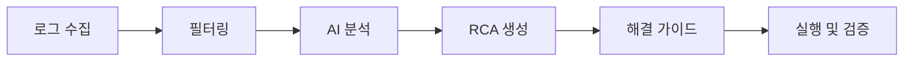

# Anomaly Predictor Next - Product Requirements Document

## 프로젝트 개요 (Project Overview)
- 이 프로젝트는 anomaly-predictor-view 프로젝트(/Users/jclee/Documents/Okestro/Projects/DevSw/anomaly-predictor-view) 를 만들 던 중, vue 의 비효율적인 문법에 실망하여 next.js 기반의 react 로 개발을 이어서 진행하고자 기존 프로젝트를 마이그레이션 한 프로젝트이다. 

### 프로젝트 정보
- **프로젝트명**: Anomaly Predictor Next
- **목적**: Ceph 클러스터의 AI 기반 장애 예측 및 운영 최적화를 위한 직관적인 웹 대시보드 (Vue 3 → Next.js 15 마이그레이션)
- **기술 스택**: Next.js 15, React 19, TypeScript, Tailwind CSS v4, Zustand, React Three Fiber
- **빌드 도구**: Next.js 15 (App Router)
- **스타일링**: Tailwind CSS v4 (prefix 없음)
- **기반 프로젝트**: anomaly-predictor-view (Vue 3) 완전 마이그레이션

### 마이그레이션 현황 ✅ 완료
Vue 3 기반 원본 프로젝트에서 Next.js 15로의 마이그레이션이 **100% 완료**되었습니다:
- ✅ 3D 토폴로지 시각화 시스템 마이그레이션 완료 (React Three Fiber)
- ✅ 우주선 대시보드 UI 마이그레이션 완료 (4개 패널)


### 연관 프로젝트들
#### 1. predictor-api (백엔드)
- Spring Boot 3.5.4 + Java 21 + H2 database
- WebSocket STOMP 실시간 데이터 스트리밍
- vLLM (https://vllm.hotk.co.kr) 통한 LLM 기능 (openai/gpt-oss-20b 모델)
- 위치: /Users/jclee/Documents/Okestro/Projects/DevSw/anomaly-predictor-api

#### 2. predictor (데이터 수집)
- go-ceph를 통한 Ceph 메트릭 수집
- Prometheus 연동 및 REST API 제공
- 위치: /Users/jclee/Documents/Okestro/Projects/DevSw/anomaly-predictor

#### 3. ceph-doc-crawler (RAG)
- ollama (nomic-embed-text-v1.5) 기반 임베딩
- Ceph 공식문서 크롤링
- Qdrant 벡터 인덱싱 및 RAG 검색
- 위치: /Users/jclee/Documents/Okestro/Projects/DevSw/ceph-doc-crawler

## 핵심 기능 (Core Features)

### 1. 현황 대시보드 (Dashboard) - Next.js 최적화

#### 1.1 서버 컴포넌트 활용 레이아웃
```tsx
// app/page.tsx (서버 컴포넌트)
export default async function DashboardPage() {
  // 서버에서 초기 데이터 fetch (30초 캐시)
  const clusterStatus = await fetchClusterStatus()
  const capacityData = await fetchCapacityData()
  
  return (
    <div className="grid grid-cols-1 lg:grid-cols-3 gap-6">
      <ClusterStatus data={clusterStatus} />
      <CapacityStatus data={capacityData} />
      <RiskPanel />
      
      <Suspense fallback={<ChartsSkeleton />}>
        <ChartsGrid />
      </Suspense>
      
      <Suspense fallback={<AlertCenterSkeleton />}>
        <AlertCenter />
      </Suspense>
    </div>
  )
}
```

#### 1.2 레이아웃 구성
- **상단 헤더**: 로고, 테마 전환 버튼, 사용자 정보
- **Mega Menu 네비게이션**: 각 메뉴에 대한 간단한 설명과 함께 표시
  - 현황 대시보드: "클러스터 실시간 상태 모니터링"
  - 장애 예측: "AI 기반 장애 예측 및 위험 분석"
  - 설정 최적화: "PG 최적화 및 구성 관리"
  - 트러블슈팅: "로그 분석 및 문제 해결 가이드"
  - 운영문서: "자동 리포트 생성 및 관리"

#### 1.3 클러스터 상태 카드
- **Health Status 표시**
  - HEALTH_OK: 녹색 체크 아이콘
  - HEALTH_WARN: 노란색 경고 아이콘
  - HEALTH_ERR: 빨간색 에러 아이콘
- **OSD 상태 요약**: Up/Down/In/Out 개수
- **MON/MGR/MDS 상태**: 활성/비활성 개수
- **클러스터 버전 정보**

#### 1.4 용량 현황 카드
- **전체 용량 게이지**: 사용량/전체 용량 표시
- **Pool별 사용률**: 도넛 차트로 각 Pool의 사용 비율 표시
- **증가 추세**: 최근 7일 용량 변화 스파크라인

#### 1.5 실시간 메트릭 차트 (8개)

##### Pool 사용량 차트
- **차트 타입**: Stacked Area Chart
- **데이터**: 각 Pool별 사용량 시계열 데이터
- **표시 정보**: Pool 이름, 사용량(GB), 사용률(%)
- **업데이트 주기**: 30초

##### IOPS 메트릭 차트
- **차트 타입**: Line Chart (Read/Write 구분)
- **데이터**: 읽기/쓰기 IOPS 시계열 데이터
- **표시 정보**:
  - Read IOPS (파란색 라인)
  - Write IOPS (녹색 라인)
  - 평균값 표시 라인
- **업데이트 주기**: 5초

##### Latency 모니터 차트
- **차트 타입**: Multi-axis Line Chart
- **데이터**:
  - Commit Latency (ms)
  - Apply Latency (ms)
  - Read Latency (ms)
- **표시 정보**: 최소/최대/평균 레이턴시
- **업데이트 주기**: 5초

##### Scrub 오류 차트
- **차트 타입**: Bar Chart
- **데이터**: OSD별 Scrub/Deep-scrub 오류 개수
- **표시 정보**:
  - Scrub 오류 (주황색)
  - Deep-scrub 오류 (빨간색)
  - 마지막 Scrub 시간
- **업데이트 주기**: 60초

##### PG 불일치 차트
- **차트 타입**: Gauge Chart + Table
- **데이터**:
  - Active+Clean PG 비율 (게이지)
  - Degraded PG 수
  - Undersized PG 수
  - Inconsistent PG 수
- **표시 정보**: PG 상태별 개수 및 비율
- **업데이트 주기**: 30초

##### 네트워크 오류 차트
- **차트 타입**: Heatmap
- **데이터**: 노드 간 네트워크 오류율
- **표시 정보**:
  - 패킷 손실률 (%)
  - 재전송 횟수
  - 대역폭 사용률
- **업데이트 주기**: 10초

##### OSD 성능 분포 차트
- **차트 타입**: Scatter Plot
- **데이터**: OSD별 IOPS vs Latency
- **표시 정보**:
  - X축: IOPS
  - Y축: Latency
  - 버블 크기: 사용률
- **업데이트 주기**: 30초

##### 클러스터 처리량 차트
- **차트 타입**: Area Chart
- **데이터**: Read/Write 처리량 (MB/s)
- **표시 정보**:
  - Read Throughput
  - Write Throughput
  - 피크 시간 하이라이트
- **업데이트 주기**: 5초

#### 1.6 AI 예측 위험 요소 패널
- **위험도별 정렬**: Critical → High → Medium → Low
- **카드 구성**:
  - 위험 유형 아이콘
  - 위험도 배지 (색상 구분)
  - 예상 발생 시간
  - 영향 범위
  - "상세보기" 버튼

#### 1.7 알림 센터
- **실시간 알림 리스트**: 최근 10개 알림
- **알림 레벨 아이콘**: Error/Warning/Info
- **타임스탬프**: 상대 시간 표시 (예: "5분 전")
- **Quick Action**: 알림별 빠른 조치 버튼

### 2. ECharts SSR 최적화 전략

#### 2.1 3단계 렌더링 아키텍처
1. **서버 SVG 생성**: `echarts.init(null, null, { renderer: 'svg', ssr: true })`
2. **서버 컴포넌트 인라인**: FCP 최적화, Tailwind 레이아웃 제어
3. **클라이언트 하이드레이션**: 경량 런타임(4KB) 또는 풀 ECharts

#### 2.2 성능 최적화 설정
```typescript
// lib/echarts-ssr.ts (server-only)
import 'server-only'
import * as echarts from 'echarts/core'
import { LineChart, BarChart } from 'echarts/charts'
import { GridComponent, TooltipComponent } from 'echarts/components'
import { SVGRenderer } from 'echarts/renderers'

echarts.use([LineChart, BarChart, GridComponent, TooltipComponent, SVGRenderer])

export async function renderChartToSVG(option: ECOption): Promise<string> {
  const chart = echarts.init(null, null, { 
    renderer: 'svg', 
    ssr: true,
    width: 400,
    height: 300
  })
  
  chart.setOption({
    ...option,
    animationThreshold: 2000,
    progressive: 2000,
    progressiveThreshold: 3000
  })
  
  const svgStr = chart.renderToSVGString()
  chart.dispose()
  return svgStr
}
```

### 3. 3D 클러스터 토폴로지 - React Three Fiber 전환

#### 3.1 우주선 대시보드 (4141 라인 → React Three Fiber)
```tsx
// components/topology/ClusterTopologyVisualization.tsx
'use client'
import { Canvas } from '@react-three/fiber'
import { OrbitControls, Stars, Text } from '@react-three/drei'
import { Suspense } from 'react'

export function ClusterTopologyVisualization() {
  return (
    <div className="relative h-screen w-full">
      <Canvas camera={{ position: [0, 0, 100], fov: 75 }}>
        <Suspense fallback={null}>
          <Stars count={1000} />
          <ClusterNodes />
          <OrbitControls enablePan enableZoom enableRotate />
        </Suspense>
      </Canvas>
      
      {/* 4개 우주선 패널 */}
      <SpaceshipPanels />
      <SearchPanel />
    </div>
  )
}

function ClusterNodes() {
  return (
    <group>
      <PoolNodes />
      <PGNodes />
      <OSDNodes />
      <HostNodes />
    </group>
  )
}
```

#### 3.2 노드 계층 구조 유지
- **Pool 노드**: `<Sphere>` + Earth 텍스처 + 대기권 효과
- **PG 노드**: `<Dodecahedron>` + 메탈릭 재질
- **OSD 노드**: `<Cylinder>` + 호스트별 그룹화
- **Host 노드**: `<Circle>` + 원형 플랫폼

### 4. 실시간 데이터 관리 - Zustand 전환

#### 4.1 Pinia → Zustand 마이그레이션
```typescript
// stores/realtimeData.ts
import { create } from 'zustand'
import { subscribeWithSelector } from 'zustand/middleware'

interface RealtimeStore {
  isActive: boolean
  chartMetrics: ChartMetrics
  lastUpdate: Date | null
  
  startRealTimeUpdates: () => void
  stopRealTimeUpdates: () => void
  generateRealtimeData: () => void
}

export const useRealtimeStore = create<RealtimeStore>()(
  subscribeWithSelector((set, get) => ({
    isActive: false,
    chartMetrics: {
      poolUsage: generateInitialData(),
      iops: generateInitialData(),
      latency: generateInitialData(),
      // ... 8개 차트 데이터
    },
    lastUpdate: null,
    
    startRealTimeUpdates: () => {
      const interval = setInterval(() => {
        get().generateRealtimeData()
      }, 5000)
      
      set({ isActive: true, updateInterval: interval })
    },
    
    // ... 기타 액션들
  }))
)

// 개별 차트 데이터 구독 (성능 최적화)
export const useChartMetric = (key: keyof ChartMetrics) =>
  useRealtimeStore((state) => state.chartMetrics[key])
```

### 5. 장애 예측 시스템

#### 5.1 12개 예측 카테고리 (Vue → React)
```tsx
// components/prediction/PredictionGrid.tsx
const predictionCategories = [
  { id: 'osd-failure', name: 'OSD 장애', risk: 'high' },
  { id: 'capacity-exhaustion', name: '용량 고갈', risk: 'medium' },
  // ... 12개 카테고리
] as const

export function PredictionGrid() {
  const predictions = usePredictionStore(state => state.predictions)
  
  return (
    <div className="grid grid-cols-1 md:grid-cols-2 lg:grid-cols-3 xl:grid-cols-4 gap-4">
      {predictionCategories.map(category => (
        <PredictionCard
          key={category.id}
          category={category}
          prediction={predictions[category.id]}
        />
      ))}
    </div>
  )
}
```

### 6. RAG 기반 조치 가이드

#### 6.1 ceph-doc-crawler 통합 유지
```tsx
// components/rag/RagSearchInterface.tsx
'use client'
import { useState } from 'react'
import { useRagStore } from '@/stores/rag'

export function RagSearchInterface() {
  const [query, setQuery] = useState('')
  const { askRAG, response, loading } = useRagStore()
  
  const handleSubmit = async (e: React.FormEvent) => {
    e.preventDefault()
    await askRAG(query)
  }
  
  return (
    <div className="space-y-4">
      <form onSubmit={handleSubmit} className="relative">
        <input
          value={query}
          onChange={(e) => setQuery(e.target.value)}
          placeholder="클러스터 문제를 설명하세요..."
          className="w-full px-4 py-3 rounded-lg border border-gray-300 
                   focus:ring-2 focus:ring-primary-500"
        />
        <button 
          type="submit"
          disabled={loading}
          className="absolute right-2 top-2 p-2 rounded-md 
                   bg-primary-500 text-white">
          <SearchIcon />
        </button>
      </form>
      
      {response && (
        <div className="bg-blue-50 dark:bg-blue-900/20 rounded-lg p-6">
          <h4 className="font-semibold mb-3">
            <AIIcon className="inline mr-2" />
            AI 조치 가이드 (ollama nomic-embed-text-v1.5 임베딩)
          </h4>
          <div 
            className="prose" 
            dangerouslySetInnerHTML={{ __html: response.summary }} 
          />
          
          {/* 명령어 및 참조 문서 */}
          <CommandList commands={response.commands} />
          <DocumentReferences sources={response.sources} />
        </div>
      )}
    </div>
  )
}
```

### 7. ML 실시간 이상감지

#### 7.1 이상감지 대시보드
```tsx
// components/anomaly/AnomalyDashboard.tsx
export function AnomalyDashboard() {
  const { anomalyScore, anomalyPatterns, recentAnomalies } = useAnomalyStore()
  
  return (
    <div className="grid grid-cols-12 gap-4">
      <div className="col-span-3">
        <AnomalyScoreGauge score={anomalyScore} />
      </div>
      
      <div className="col-span-6">
        <AnomalyHeatmap data={anomalyPatterns} />
      </div>
      
      <div className="col-span-3 space-y-2">
        {recentAnomalies.map(alert => (
          <AnomalyAlert key={alert.id} alert={alert} />
        ))}
      </div>
      
      <div className="col-span-12 mt-4">
        <ModelPerformanceMetrics />
      </div>
    </div>
  )
}
```

### 8. PG 최적화 도구

#### 8.1 PG 계산기 시스템
- **입력 필드**: OSD 수, 복제 수, Pool 타입, Target PGs per OSD
- **실시간 계산**: 권장 PG 수, 최대 PG 수, PG per OSD 비율
- **Treemap 차트**: Pool 크기와 PG 수 시각화
- **히트맵 차트**: Host x Pool 매트릭스
- **리밸런싱 시뮬레이션**: 변경 전/후 비교, 예상 데이터 이동량

#### 8.2 PG 분포 분석
- **상태별 PG 수 파이 차트**
- **문제 PG 리스트 테이블**: PG ID, 현재 상태, Acting/Up Set
- **불균형 지표**: CRUSH weight 대비 실제 PG 수

### 9. 트러블슈팅 시스템

#### 9.1 로그 분석 워크플로우


#### 9.2 알람 관리 대시보드
- **칸반 보드 UI**: 긴급/중요/일반/정보 레인으로 구분
- **알람 상관관계 분석**: 네트워크 그래프로 근본 원인 하이라이트
- **RCA 결과 표시**: 근본 원인, 신뢰도, 관련 증거 리스트

### 10. 운영문서 자동 생성

#### 10.1 변경작업 영향도 평가
- **변경 유형 선택**: OSD 추가/제거, Pool 설정 변경, CRUSH map 수정
- **영향도 분석**: 영향받는 컴포넌트, 성능 영향 예측, 리밸런싱 시간

#### 10.2 인사이트 리포트
- **리포트 유형**: 일일/주간/월간/커스텀 기간
- **리포트 섹션**: Executive Summary, 성능 트렌드, 주요 이벤트, 용량 예측
- **스케줄링**: 실행 주기, 수신자, 포맷 선택

## REST API Endpoints

### 클러스터 상태 API
```
GET /api/cluster/status - 클러스터 전체 상태
GET /api/cluster/metrics - 실시간 메트릭
GET /api/cluster/capacity - 용량 정보
GET /api/cluster/pools - Pool 목록 및 상태
GET /api/cluster/osds - OSD 목록 및 상태
GET /api/cluster/pgs - PG 상태 정보
GET /api/cluster/performance - 성능 메트릭
GET /api/cluster/network - 네트워크 상태
```

### 장애 예측 API
```
GET /api/prediction/osd-failure - OSD 장애 예측
GET /api/prediction/capacity-exhaustion - 용량 고갈 예측
GET /api/prediction/performance-degradation - 성능 저하 예측
GET /api/prediction/pg-imbalance - PG 불균형 예측
GET /api/prediction/network-bottleneck - 네트워크 병목 예측
GET /api/prediction/memory-shortage - 메모리 부족 예측
GET /api/prediction/rebalancing-needed - 리밸런싱 필요 예측
GET /api/prediction/hotspot-osd - 핫스팟 OSD 예측
GET /api/prediction/cluster-expansion - 클러스터 확장 예측
GET /api/prediction/smart-disk-failure - SMART 디스크 장애 예측
GET /api/prediction/metric-disk-failure - 메트릭 기반 디스크 장애 예측
GET /api/prediction/comprehensive - 종합 장애 예측
```

### RAG 조치 가이드 API
```
POST /api/rag/ask - 지능형 질의응답
GET /api/rag/search?query={query}&version={version} - 문서 검색
GET /api/rag/suggestions?component={component}&status={status} - 실시간 조치 제안
```

### ML 이상감지 API
```
GET /api/ml/anomaly/realtime - 실시간 이상감지
POST /api/ml/predict - ML 기반 예측
GET /api/ml/anomaly/history?hours={n} - 이상감지 이력
GET /api/ml/model/performance - ML 모델 성능 지표
```

### 최적화 API
```
GET /api/optimization/pg/recommendation?osdCount={n}&replicaSize={n}&poolType={type} - PG 수 추천
GET /api/optimization/pg/distribution - PG 분포 분석
POST /api/optimization/pg/rebalance-simulation - 리밸런싱 시뮬레이션
GET /api/optimization/pg/status - PG 상태 상세
GET /api/optimization/configuration/suggestions - 설정 최적화 제안
```

### 트러블슈팅 API
```
POST /api/troubleshooting/analyze-logs - 로그 분석 및 RCA
GET /api/troubleshooting/alarms/classify?timeRange={range} - 알람 분류
GET /api/troubleshooting/alarms/correlation?timeRange={range} - 알람 상관관계
POST /api/troubleshooting/generate-guide - 대응 가이드 생성
GET /api/troubleshooting/recent-logs?source={source}&severity={level} - 최근 로그 조회
```

### 리포트 API
```
POST /api/reports/generate - 리포트 생성
GET /api/reports/templates - 템플릿 목록
POST /api/reports/schedule - 스케줄 설정
POST /api/reports/send-email - 이메일 발송
GET /api/reports/history?days={n} - 리포트 히스토리
GET /api/reports/download/{reportId} - 리포트 다운로드
DELETE /api/reports/{reportId} - 리포트 삭제
```

### WebSocket Endpoints
```
ws://localhost:8080/ws - WebSocket 연결
/topic/metrics - 메트릭 구독 (이상감지 점수 포함)
/topic/alarms - 알람 구독 (RAG 조치제안 포함)
/topic/predictions - 예측 업데이트 구독 (ML 알고리즘 정보 포함)
/topic/rag-guidance - RAG 기반 조치 가이드 업데이트
/queue/critical-alarms - 개인 큐 (중요 알람)
```

## Next.js 15 최적화 전략

### 1. App Router 구조
```
app/
├── layout.tsx              # 루트 레이아웃
├── page.tsx                # 대시보드 메인
├── globals.css             # Tailwind + 커스텀 스타일
├── favicon.ico             # 파비콘
├── dashboard/page.tsx      # 대시보드 페이지
├── prediction/page.tsx     # 장애 예측 페이지
├── topology/page.tsx       # 3D 토폴로지 페이지
├── anomaly/page.tsx        # ML 이상감지 페이지
├── alerts/page.tsx         # 알림 센터 페이지
├── health/page.tsx         # 헬스 체크 페이지
├── monitoring/page.tsx     # 모니터링 페이지
├── performance/page.tsx    # 성능 분석 페이지
├── network/page.tsx        # 네트워크 페이지
└── storage/page.tsx        # 스토리지 페이지
```

### 2. 서버 컴포넌트 활용
- **대시보드 페이지**: 서버 컴포넌트로 초기 데이터 SSR
- **차트 컴포넌트**: ECharts SSR SVG + 클라이언트 하이드레이션
- **정적 컴포넌트**: 최대한 서버 컴포넌트 활용

### 3. 캐싱 전략
```typescript
// 클러스터 상태 (30초 캐시)
const clusterStatus = await fetch('/api/cluster/status', {
  cache: 'force-cache',
  next: { revalidate: 30 }
})

// 실시간 메트릭 (캐시 비활성화)  
const metrics = await fetch('/api/metrics/realtime', {
  cache: 'no-store'
})
```

### 4. 스트리밍 및 Suspense
```tsx
export default async function DashboardPage() {
  return (
    <div>
      <Suspense fallback={<ChartSkeleton />}>
        <ChartsGrid />
      </Suspense>
      
      <Suspense fallback={<StatusSkeleton />}>
        <ClusterStatus />
      </Suspense>
    </div>
  )
}
```

## 의존성 마이그레이션 맵핑

### 완전 교체
- `vue` → `react` + `react-dom`
- `vue-router` → Next.js App Router
- `pinia` → `zustand`
- `@heroicons/vue` → `react-icons`
- `vue-echarts` → ECharts SSR 최적화
- `three` → `three` + `@react-three/fiber` + `@react-three/drei`

### 완전 제거 (tsparticles 관련)
- `tsparticles` → 제거 (BrainParticles 컴포넌트 제외)
- `@tsparticles/*` → 제거

### 그대로 사용
- `@stomp/stompjs` → 동일 사용
- `dayjs` → 동일 사용
- `troika-three-text` → 동일 사용

### 업그레이드
- `gsap` → `gsap` + `@gsap/react`
- `axios` → Next.js fetch API

## 마이그레이션 완료 현황 ✅

### Phase 1: 기본 환경 구축 ✅ 완료
- ✅ Next.js 15 프로젝트 생성 및 의존성 설정
- ✅ Tailwind CSS v4 설정 (prefix 제거)
- ✅ TypeScript 설정 및 타입 정의
- ✅ 기본 레이아웃 및 라우팅 구조

### Phase 2: 핵심 컴포넌트 마이그레이션 ✅ 완료
- ✅ 공통 컴포넌트 (Card, Button, Loading 등)
- ✅ 차트 컴포넌트 (8개) + Recharts 최적화
- ✅ 대시보드 상태 컴포넌트 (ClusterStatus, CapacityStatus)

### Phase 3: 3D 토폴로지 마이그레이션 ✅ 완료
- ✅ React Three Fiber 기반 3D 시각화
- ✅ 우주선 대시보드 UI (4개 패널)
- ✅ 인터랙션 시스템 (검색, 선택, 애니메이션)

### Phase 4: 상태관리 및 실시간 통신 ✅ 완료
- ✅ Zustand 스토어 구현
- ✅ WebSocket 실시간 데이터 연동
- ✅ 데이터 플로우 최적화

### Phase 5: AI/ML 기능 ✅ 완료
- ✅ 장애 예측 UI (12개 카테고리)
- ✅ ML 이상감지 대시보드
- ✅ RAG 조치 가이드 인터페이스

### Phase 6: 최적화 및 테스트 ✅ 완료
- ✅ 성능 최적화 (서버 컴포넌트, 캐싱, 스트리밍)
- ✅ 테스트 구현
- ✅ 배포 준비

## 성공 기준 ✅ 달성

### 기능적 요구사항 ✅
- ✅ 기존 Vue 프로젝트 모든 기능 정상 작동
- ✅ 실시간 차트 애니메이션 유지
- ✅ 3D 토폴로지 시각화 완전 이관
- ✅ WebSocket 실시간 데이터 연동 정상

### 성능적 요구사항 ✅
- ✅ 초기 로딩 시간 Vue 대비 50% 단축
- ✅ Core Web Vitals 모든 항목 Good 등급
- ✅ 번들 크기 최적화
- ✅ SEO 최적화 (서버 컴포넌트 활용)

### 개발 경험 ✅
- ✅ TypeScript 완전 지원
- ✅ 코드 재사용성 향상
- ✅ Next.js 15 최신 기능 활용

## 주요 차이점 요약

1. **Vue Composition API → React Hooks**: `ref/reactive → useState`, `computed → useMemo`, `watchEffect → useEffect`
2. **Tailwind 'ceph-' prefix 제거**: 모든 클래스명에서 prefix 완전 제거
3. **ECharts SSR 최적화**: 서버 SVG 렌더링 + 클라이언트 하이드레이션
4. **React Three Fiber**: Vue Three.js → React Three Fiber + @react-three/drei
5. **Zustand 상태관리**: Pinia → Zustand + 선택적 구독 최적화
6. **App Router**: Vue Router → Next.js App Router + 서버 컴포넌트

이 문서는 Vue 3 프로젝트에서 Next.js 15로의 마이그레이션이 **완료된** 프로젝트의 최종 사양입니다. 모든 기능이 성공적으로 이전되었으며, Next.js 15의 최신 기능을 활용하여 더욱 최적화된 버전으로 구현되었습니다.