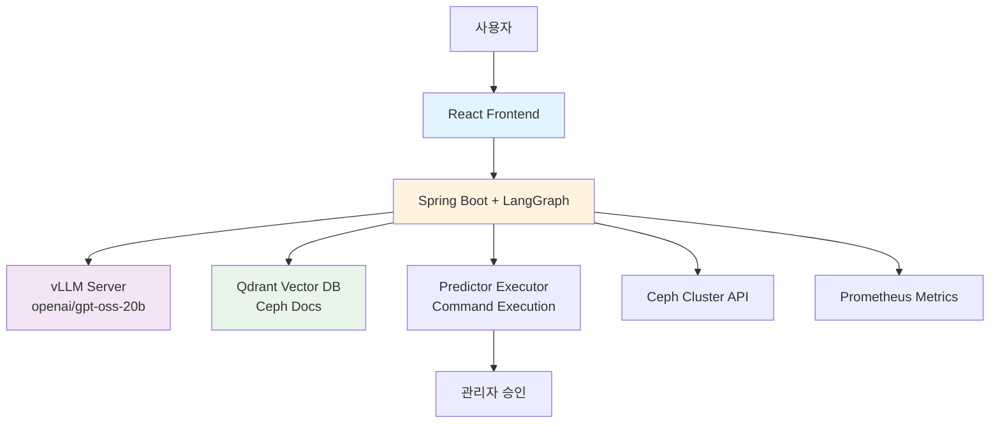
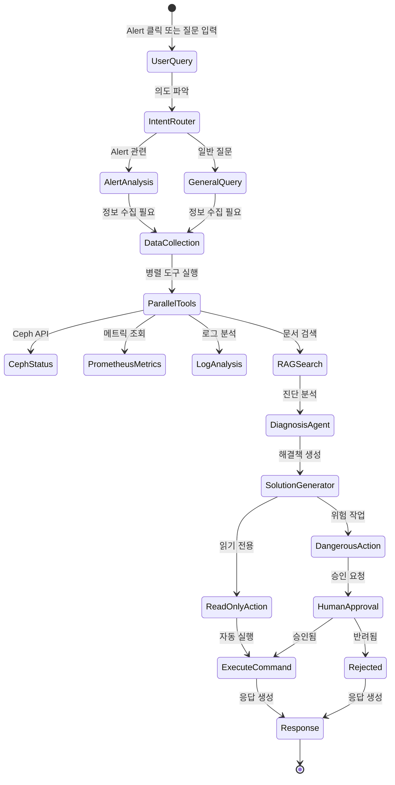
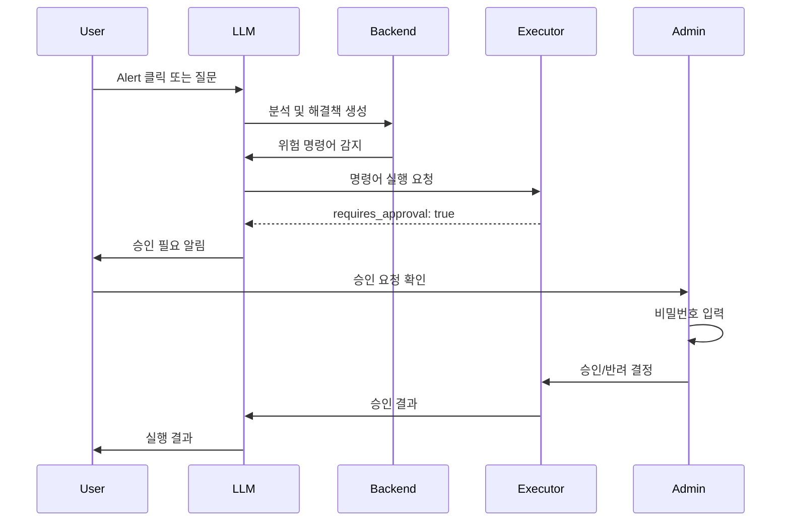

# 트러블슈팅 가이드 시스템 - Product Requirements Document

## 📋 목차
1. [프로젝트 개요](#프로젝트-개요)
2. [시스템 아키텍처](#시스템-아키텍처)
3. [UI/UX 디자인 명세](#uiux-디자인-명세)
4. [백엔드 구현 (LangGraph)](#백엔드-구현-langgraph)
5. [프론트엔드 구현](#프론트엔드-구현)
6. [API 통합](#api-통합)
7. [승인 워크플로우](#승인-워크플로우)
8. [보안 및 안전성](#보안-및-안전성)
9. [기술 스택](#기술-스택)
10. [개발 단계](#개발-단계)
11. [체크리스트](#체크리스트)

---

## 프로젝트 개요

### 목적
Ceph 클러스터의 alert를 기반으로 AI와의 대화를 통해 문제의 원인을 파악하고 해결책을 제공하는 인터랙티브 트러블슈팅 가이드 시스템

### 핵심 기능
- **Alert 기반 대화 시작**: Ceph alert 클릭 시 해당 문제에 대한 AI 분석 및 대화 시작
- **자동 정보 수집**: LLM이 필요시 자동으로 시스템 정보 수집 tool 실행
- **RAG 기반 정확한 답변**: Ceph 문서 벡터DB를 활용한 높은 정확도의 조치 가이드
- **명령어 실행 및 승인**: 위험한 명령어는 관리자 승인 후 실행
- **실시간 진행 상황**: 정보 수집, 분석, 해결 과정의 실시간 표시

### 접근 경로
`/app/trouble/page.tsx` - AppHeader의 Resilience > Trouble Shooting Guide 메뉴

---

## 시스템 아키텍처

### 전체 구조


### LangGraph StateGraph 구조


---

## UI/UX 디자인 명세

### 디자인 원칙
- **엔터프라이즈급 품격**: 대기업 환경에 적합한 전문적이고 신뢰감 있는 디자인
- **인터랙티브 요소**: 부드러운 애니메이션과 즉각적인 피드백
- **다크 테마 기반**: 눈의 피로를 줄이는 세련된 다크 모드
- **정보 계층 구조**: 명확한 시각적 계층으로 정보 우선순위 표현

### 페이지 레이아웃

#### 1. 메인 컨테이너 (3-Column Layout)
```tsx
interface TroublePageLayout {
  leftPanel: AlertListPanel;      // 25% width - Alert 목록
  centerPanel: ChatInterface;     // 50% width - AI 대화
  rightPanel: InfoPanel;          // 25% width - 컨텍스트 정보
}
```

#### 2. Alert List Panel (왼쪽)
```scss
.alert-list-panel {
  background: linear-gradient(135deg, #0a0f1a 0%, #0d1420 100%);
  border-right: 1px solid rgba(99, 179, 237, 0.2);

  .alert-item {
    padding: 16px;
    border-bottom: 1px solid rgba(99, 179, 237, 0.1);
    transition: all 0.3s cubic-bezier(0.4, 0, 0.2, 1);

    &:hover {
      background: rgba(99, 179, 237, 0.05);
      transform: translateX(4px);
    }

    &.critical {
      border-left: 3px solid #ff3366;
      animation: pulse-critical 2s infinite;
    }

    &.warning {
      border-left: 3px solid #ffaa00;
    }

    &.info {
      border-left: 3px solid #00ccff;
    }
  }
}

@keyframes pulse-critical {
  0%, 100% { opacity: 1; }
  50% { opacity: 0.7; }
}
```

##### Alert Card 구성 요소
- **Severity Indicator**: 색상 코드 + 아이콘
- **Alert Title**: 문제 요약
- **Component**: 영향받는 컴포넌트 (OSD, MON, PG 등)
- **Timestamp**: 상대 시간 표시
- **Quick Actions**: 즉시 실행 가능한 조치 버튼
- **AI Insight Badge**: AI가 분석한 위험도 표시

#### 3. Chat Interface (중앙)
```tsx
interface ChatMessage {
  id: string;
  role: 'user' | 'assistant' | 'system' | 'tool';
  content: string;
  timestamp: Date;
  metadata?: {
    alertId?: string;
    toolCalls?: ToolCall[];
    sources?: RAGSource[];
    approvalRequired?: boolean;
    approvalId?: string;
  };
  status?: 'sending' | 'sent' | 'error' | 'pending_approval';
}
```

##### 대화 인터페이스 특징
- **타이핑 애니메이션**: ChatGPT 스타일 스트리밍 응답
- **마크다운 렌더링**: 코드 블록, 테이블, 리스트 완벽 지원
- **Tool 실행 시각화**: 실행중인 도구를 실시간으로 표시
  ```tsx
  <ToolExecutionCard>
    <Spinner /> Ceph 클러스터 상태 조회 중...
    <ProgressBar value={progress} />
  </ToolExecutionCard>
  ```
- **소스 참조**: RAG 검색 결과 출처 표시
- **승인 요청 카드**: 위험한 명령어 실행 시 특별 UI

#### 4. Info Panel (오른쪽)
```tsx
interface InfoPanel {
  sections: {
    currentContext: ClusterContext;      // 현재 클러스터 상태
    activeTools: ActiveTool[];           // 실행 중인 도구
    commandHistory: CommandHistory[];     // 최근 실행 명령어
    relatedDocs: Document[];             // 관련 문서
    suggestedActions: Action[];          // 추천 조치사항
  };
}
```

##### 애니메이션 효과
```scss
.info-card {
  animation: slideInRight 0.5s ease-out;

  &.updating {
    animation: pulse 1s infinite;
  }

  .metric-value {
    transition: all 0.3s ease;

    &.changed {
      animation: highlight 1s ease;
    }
  }
}

@keyframes highlight {
  0% { background: transparent; }
  50% { background: rgba(0, 255, 255, 0.2); }
  100% { background: transparent; }
}
```

### 관리자 승인 Drawer

#### 위치 및 애니메이션
- 화면 우측에서 슬라이드 인
- 너비: 500px
- 백드롭 블러 효과

```tsx
interface ApprovalDrawer {
  isOpen: boolean;
  isAuthenticated: boolean;
  pendingApprovals: ApprovalRequest[];

  onAuthenticate: (password: string) => void;
  onApprove: (requestId: string, comment: string) => void;
  onReject: (requestId: string, reason: string) => void;
}
```

#### 승인 요청 카드
```scss
.approval-card {
  background: linear-gradient(135deg, #1a0f0f 0%, #2a1414 100%);
  border: 1px solid rgba(255, 51, 102, 0.3);
  border-radius: 12px;
  padding: 20px;
  margin-bottom: 16px;

  .risk-level {
    &.critical {
      color: #ff3366;
      font-weight: bold;
      animation: blink 1s infinite;
    }

    &.high {
      color: #ff6633;
    }

    &.medium {
      color: #ffaa00;
    }
  }

  .command-preview {
    font-family: 'JetBrains Mono', monospace;
    background: #0a0a0a;
    padding: 12px;
    border-radius: 8px;
    border: 1px solid rgba(255, 255, 255, 0.1);
  }

  .impact-list {
    li {
      &:before {
        content: "⚠️";
        margin-right: 8px;
      }
    }
  }
}
```

### 인터랙티브 요소

#### 1. Alert 호버 효과
```tsx
const AlertItem = ({ alert }) => {
  const [isHovered, setIsHovered] = useState(false);

  return (
    <motion.div
      onHoverStart={() => setIsHovered(true)}
      onHoverEnd={() => setIsHovered(false)}
      animate={{
        scale: isHovered ? 1.02 : 1,
        x: isHovered ? 4 : 0,
      }}
      transition={{ type: "spring", stiffness: 300 }}
    >
      {isHovered && (
        <motion.div
          initial={{ opacity: 0, y: -10 }}
          animate={{ opacity: 1, y: 0 }}
          className="quick-actions"
        >
          <button>빠른 진단</button>
          <button>상세 정보</button>
        </motion.div>
      )}
    </motion.div>
  );
};
```

#### 2. Tool 실행 애니메이션
```tsx
const ToolExecution = ({ tool, status }) => {
  return (
    <motion.div
      initial={{ opacity: 0, height: 0 }}
      animate={{ opacity: 1, height: "auto" }}
      exit={{ opacity: 0, height: 0 }}
      className="tool-execution"
    >
      <div className="tool-header">
        <AnimatedIcon type={tool.type} />
        <span>{tool.name}</span>
        <StatusBadge status={status} />
      </div>

      {status === 'running' && (
        <div className="execution-details">
          <LoadingDots />
          <ProgressBar indeterminate />
          <span className="execution-time">{elapsedTime}s</span>
        </div>
      )}

      {status === 'completed' && (
        <motion.div
          initial={{ opacity: 0 }}
          animate={{ opacity: 1 }}
          className="execution-result"
        >
          <pre>{tool.result}</pre>
        </motion.div>
      )}
    </motion.div>
  );
};
```

#### 3. 승인 요청 알림
```tsx
const ApprovalNotification = ({ approval }) => {
  return (
    <motion.div
      initial={{ x: 400, opacity: 0 }}
      animate={{ x: 0, opacity: 1 }}
      exit={{ x: 400, opacity: 0 }}
      className="approval-notification"
    >
      <div className="notification-glow" />
      <div className="notification-content">
        <WarningIcon className="pulse" />
        <div>
          <h4>관리자 승인 필요</h4>
          <p>{approval.command}</p>
          <div className="risk-indicator">
            <span>위험도: {approval.riskLevel}</span>
          </div>
        </div>
      </div>
      <motion.button
        whileHover={{ scale: 1.05 }}
        whileTap={{ scale: 0.95 }}
        className="review-button"
        onClick={openApprovalDrawer}
      >
        검토하기
      </motion.button>
    </motion.div>
  );
};
```

---

## 백엔드 구현 (LangGraph)

### 패키지 구조
```
com.okestro.anomaly.predictor.services.trouble/
├── controller/
│   ├── TroubleController.java
│   └── ApprovalController.java
├── service/
│   ├── TroubleService.java
│   ├── LangGraphService.java
│   └── ApprovalService.java
├── graph/
│   ├── TroubleStateGraph.java
│   ├── state/
│   │   ├── TroubleState.java
│   │   └── ApprovalState.java
│   ├── nodes/
│   │   ├── IntentRouterNode.java
│   │   ├── DataCollectionNode.java
│   │   ├── DiagnosisNode.java
│   │   ├── SolutionGeneratorNode.java
│   │   └── ExecutionNode.java
│   └── tools/
│       ├── CephTool.java
│       ├── PrometheusTool.java
│       ├── ExecutorTool.java
│       └── RAGTool.java
├── dto/
│   ├── request/
│   │   ├── TroubleRequest.java
│   │   └── ApprovalDecision.java
│   └── response/
│       ├── TroubleResponse.java
│       └── ApprovalStatus.java
└── config/
    └── LangGraphConfig.java
```

### LangGraph 구현

#### 1. State 모델
```java
package com.okestro.anomaly.predictor.services.trouble.graph.state;

import lombok.Data;
import java.util.*;

@Data
public class TroubleState {
    // 대화 컨텍스트
    private String threadId;
    private List<Message> messages;
    private String currentAlertId;
    private AlertInfo alertInfo;

    // Raw 데이터 (DB 저장, LLM에는 전달 안함)
    private Map<String, Object> rawCephData;
    private List<String> fullLogs;
    private Map<String, Double> allMetrics;

    // 요약된 컨텍스트 (LLM에 전달)
    private CephHealthSummary healthSummary;
    private List<CriticalEvent> criticalEvents;
    private Map<String, String> keyMetrics;

    // RAG 검색 결과
    private List<DocumentChunk> ragResults;
    private String contextualKnowledge;

    // 진단 결과
    private DiagnosisResult diagnosis;
    private List<Solution> proposedSolutions;
    private Solution selectedSolution;

    // 실행 관련
    private List<CommandToExecute> pendingCommands;
    private Map<String, CommandResult> executionResults;
    private boolean requiresApproval;
    private String approvalRequestId;
    private ApprovalStatus approvalStatus;

    // 상태 추적
    private String currentNode;
    private WorkflowStatus status;
    private long startTime;
    private Map<String, Long> nodeExecutionTimes;
}
```

#### 2. StateGraph 정의
```java
package com.okestro.anomaly.predictor.services.trouble.graph;

import org.bsc.langgraph4j.StateGraph;
import org.bsc.langgraph4j.checkpoint.PostgresSaver;
import org.springframework.stereotype.Component;

@Component
public class TroubleStateGraph {

    private final StateGraph<TroubleState> graph;
    private final PostgresSaver checkpointSaver;

    public TroubleStateGraph(
        IntentRouterNode intentRouter,
        DataCollectionNode dataCollection,
        DiagnosisNode diagnosis,
        SolutionGeneratorNode solutionGenerator,
        ExecutionNode execution,
        PostgresSaver checkpointSaver
    ) {
        this.checkpointSaver = checkpointSaver;

        this.graph = new StateGraph<>(TroubleState.class)
            // 노드 추가
            .addNode("intent_router", intentRouter::process)
            .addNode("data_collection", dataCollection::process)
            .addNode("diagnosis", diagnosis::process)
            .addNode("solution_generator", solutionGenerator::process)
            .addNode("check_approval", this::checkApprovalRequired)
            .addNode("wait_approval", this::waitForApproval)
            .addNode("execute_commands", execution::process)
            .addNode("generate_response", this::generateFinalResponse)

            // 엣지 정의
            .addEdge(START, "intent_router")
            .addConditionalEdge("intent_router",
                this::routeByIntent,
                Map.of(
                    "alert_analysis", "data_collection",
                    "general_query", "diagnosis",
                    "command_execution", "check_approval"
                )
            )
            .addEdge("data_collection", "diagnosis")
            .addEdge("diagnosis", "solution_generator")
            .addEdge("solution_generator", "check_approval")
            .addConditionalEdge("check_approval",
                this::checkIfApprovalNeeded,
                Map.of(
                    "needs_approval", "wait_approval",
                    "auto_execute", "execute_commands"
                )
            )
            .addConditionalEdge("wait_approval",
                this::checkApprovalStatus,
                Map.of(
                    "approved", "execute_commands",
                    "rejected", "generate_response",
                    "waiting", "wait_approval"
                )
            )
            .addEdge("execute_commands", "generate_response")
            .addEdge("generate_response", END)

            // 체크포인터 설정
            .withCheckpointer(checkpointSaver)
            .build();
    }
}
```

#### 3. Tool 구현
```java
package com.okestro.anomaly.predictor.services.trouble.graph.tools;

import dev.langchain4j.agent.tool.Tool;
import org.springframework.stereotype.Component;

@Component
public class CephTool {

    private final CephApiUtil cephApiUtil;

    @Tool("Ceph 클러스터 상태 조회")
    public CephStatus fetchCephStatus() {
        return cephApiUtil.getStatus();
    }

    @Tool("OSD 트리 구조 조회")
    public OsdTree fetchOsdTree() {
        return cephApiUtil.getOsdTree();
    }

    @Tool("PG 상태 조회")
    public PgStatus fetchPgStatus(
        @ToolParam("pool_name") String poolName
    ) {
        return cephApiUtil.getPgStatus(poolName);
    }

    @Tool("최근 Ceph 로그 조회")
    public List<LogEntry> fetchCephLogs(
        @ToolParam("hours") int hours,
        @ToolParam("severity") String severity
    ) {
        return cephApiUtil.getRecentLogs(hours, severity);
    }

    @Tool("특정 OSD 상세 정보 조회")
    public OsdDetail fetchOsdDetail(
        @ToolParam("osd_id") int osdId
    ) {
        return cephApiUtil.getOsdDetail(osdId);
    }
}

@Component
public class ExecutorTool {

    private final ExecutorClient executorClient;

    @Tool("안전한 명령어 실행")
    public CommandResult executeSafeCommand(
        @ToolParam("command") String command,
        @ToolParam("args") List<String> args
    ) {
        ExecuteRequest request = ExecuteRequest.builder()
            .command(command)
            .args(args)
            .timeout(30)
            .context(ExecutionContext.builder()
                .requester("AI Assistant")
                .requestReason("Troubleshooting")
                .build())
            .build();

        return executorClient.execute(request);
    }

    @Tool("승인 필요 명령어 요청")
    public ApprovalRequest requestDangerousCommand(
        @ToolParam("command") String command,
        @ToolParam("args") List<String> args,
        @ToolParam("reason") String reason
    ) {
        // 위험한 명령어는 승인 요청만 생성
        return executorClient.requestApproval(command, args, reason);
    }
}

@Component
public class RAGTool {

    private final RAGClient ragClient;

    @Tool("Ceph 문서에서 해결책 검색")
    public RAGSearchResult searchSolution(
        @ToolParam("query") String query,
        @ToolParam("error_type") String errorType
    ) {
        SearchRequest request = SearchRequest.builder()
            .query(query)
            .language("ko")
            .docTypes(Arrays.asList("troubleshooting", "cli", "config"))
            .topK(5)
            .scoreThreshold(0.7f)
            .filters(Map.of(
                "section", errorType,
                "version", "squid"
            ))
            .includeHighlights(true)
            .build();

        return ragClient.search(request);
    }
}
```

#### 4. 병렬 데이터 수집
```java
package com.okestro.anomaly.predictor.services.trouble.graph.nodes;

import org.springframework.stereotype.Component;
import java.util.concurrent.CompletableFuture;

@Component
public class DataCollectionNode {

    private final CephTool cephTool;
    private final PrometheusTool prometheusTool;
    private final ExecutorTool executorTool;

    public TroubleState process(TroubleState state) {
        // 병렬 데이터 수집
        CompletableFuture<CephStatus> statusFuture =
            CompletableFuture.supplyAsync(cephTool::fetchCephStatus);

        CompletableFuture<OsdTree> osdTreeFuture =
            CompletableFuture.supplyAsync(cephTool::fetchOsdTree);

        CompletableFuture<List<LogEntry>> logsFuture =
            CompletableFuture.supplyAsync(() ->
                cephTool.fetchCephLogs(24, "ERROR"));

        CompletableFuture<Map<String, Double>> metricsFuture =
            CompletableFuture.supplyAsync(() ->
                prometheusTool.queryInstant(buildMetricQueries(state)));

        // 모든 Future 완료 대기
        CompletableFuture.allOf(
            statusFuture, osdTreeFuture, logsFuture, metricsFuture
        ).join();

        // 결과 수집
        state.setRawCephData(Map.of(
            "status", statusFuture.join(),
            "osdTree", osdTreeFuture.join()
        ));
        state.setFullLogs(logsFuture.join());
        state.setAllMetrics(metricsFuture.join());

        // 요약 생성 (LLM 전달용)
        state.setHealthSummary(summarizeHealth(statusFuture.join()));
        state.setCriticalEvents(extractCriticalEvents(logsFuture.join()));
        state.setKeyMetrics(extractKeyMetrics(metricsFuture.join()));

        return state;
    }

    private CephHealthSummary summarizeHealth(CephStatus status) {
        // Raw 데이터를 LLM이 이해하기 쉬운 형태로 요약
        return CephHealthSummary.builder()
            .overallHealth(status.getHealth())
            .activeAlerts(status.getChecks().size())
            .degradedPGs(countDegradedPGs(status))
            .downOSDs(countDownOSDs(status))
            .summary(buildHealthSummaryText(status))
            .build();
    }
}
```

#### 5. SSE 스트리밍 컨트롤러
```java
package com.okestro.anomaly.predictor.services.trouble.controller;

import org.springframework.web.bind.annotation.*;
import org.springframework.http.MediaType;
import reactor.core.publisher.Flux;
import org.springframework.http.codec.ServerSentEvent;

@RestController
@RequestMapping("/api/trouble")
public class TroubleController {

    private final LangGraphService langGraphService;

    @PostMapping(value = "/chat",
                 produces = MediaType.TEXT_EVENT_STREAM_VALUE)
    public Flux<ServerSentEvent<TroubleEvent>> chat(
        @RequestBody TroubleRequest request
    ) {
        String threadId = request.getThreadId() != null ?
            request.getThreadId() : UUID.randomUUID().toString();

        return langGraphService.streamProcess(threadId, request)
            .map(event -> ServerSentEvent.<TroubleEvent>builder()
                .id(event.getId())
                .event(event.getType().toString())
                .data(event)
                .build());
    }

    @GetMapping("/alerts/active")
    public List<AlertInfo> getActiveAlerts() {
        return langGraphService.getActiveAlerts();
    }
}
```

---

## 프론트엔드 구현

### 파일 구조
```
app/trouble/
├── page.tsx                    # 메인 페이지
├── components/
│   ├── AlertListPanel.tsx      # Alert 목록 패널
│   ├── ChatInterface.tsx       # 채팅 인터페이스
│   ├── InfoPanel.tsx           # 정보 패널
│   ├── ApprovalDrawer.tsx      # 승인 Drawer
│   ├── MessageBubble.tsx       # 메시지 버블
│   ├── ToolExecution.tsx       # Tool 실행 표시
│   └── MarkdownRenderer.tsx    # 마크다운 렌더러
├── hooks/
│   ├── useTroubleChat.ts      # 채팅 로직
│   ├── useSSE.ts               # SSE 연결
│   └── useApproval.ts          # 승인 관리
└── stores/
    └── troubleStore.ts         # Zustand store
```

### 메인 페이지 구현
```tsx
// app/trouble/page.tsx
'use client';

import React, { useState, useEffect } from 'react';
import { motion, AnimatePresence } from 'framer-motion';
import AlertListPanel from './components/AlertListPanel';
import ChatInterface from './components/ChatInterface';
import InfoPanel from './components/InfoPanel';
import ApprovalDrawer from './components/ApprovalDrawer';
import { useTroubleStore } from './stores/troubleStore';
import { useSSE } from './hooks/useSSE';

export default function TroublePage() {
    const [selectedAlert, setSelectedAlert] = useState<Alert | null>(null);
    const [isApprovalDrawerOpen, setApprovalDrawerOpen] = useState(false);
    const { alerts, messages, sendMessage } = useTroubleStore();

    // SSE 연결
    const { events } = useSSE('/api/trouble/stream');

    useEffect(() => {
        // SSE 이벤트 처리
        events.forEach(event => {
            switch(event.type) {
                case 'TOOL_EXECUTION':
                    handleToolExecution(event.data);
                    break;
                case 'APPROVAL_REQUIRED':
                    handleApprovalRequired(event.data);
                    break;
                case 'MESSAGE':
                    handleNewMessage(event.data);
                    break;
            }
        });
    }, [events]);

    const handleAlertClick = (alert: Alert) => {
        setSelectedAlert(alert);
        sendMessage({
            type: 'alert',
            alertId: alert.id,
            content: `Alert "${alert.title}" 에 대한 분석을 시작합니다.`
        });
    };

    return (
        <div className="h-screen flex bg-gradient-to-br from-secondary-900 via-ai-neural to-secondary-800">
            {/* Alert List Panel */}
            <motion.div
                className="w-1/4 border-r border-ai-circuit/20"
                initial={{ x: -100, opacity: 0 }}
                animate={{ x: 0, opacity: 1 }}
                transition={{ duration: 0.5 }}
            >
                <AlertListPanel
                    alerts={alerts}
                    selectedAlert={selectedAlert}
                    onAlertClick={handleAlertClick}
                />
            </motion.div>

            {/* Chat Interface */}
            <motion.div
                className="flex-1"
                initial={{ scale: 0.9, opacity: 0 }}
                animate={{ scale: 1, opacity: 1 }}
                transition={{ duration: 0.5, delay: 0.2 }}
            >
                <ChatInterface
                    selectedAlert={selectedAlert}
                    messages={messages}
                    onSendMessage={sendMessage}
                />
            </motion.div>

            {/* Info Panel */}
            <motion.div
                className="w-1/4 border-l border-ai-circuit/20"
                initial={{ x: 100, opacity: 0 }}
                animate={{ x: 0, opacity: 1 }}
                transition={{ duration: 0.5, delay: 0.3 }}
            >
                <InfoPanel />
            </motion.div>

            {/* Approval Drawer */}
            <AnimatePresence>
                {isApprovalDrawerOpen && (
                    <ApprovalDrawer
                        isOpen={isApprovalDrawerOpen}
                        onClose={() => setApprovalDrawerOpen(false)}
                    />
                )}
            </AnimatePresence>

            {/* Admin Button */}
            <motion.button
                className="fixed bottom-8 right-8 p-4 bg-gradient-to-r from-danger-500 to-danger-600 rounded-full shadow-lg"
                whileHover={{ scale: 1.1 }}
                whileTap={{ scale: 0.95 }}
                onClick={() => setApprovalDrawerOpen(true)}
            >
                <ShieldCheckIcon className="w-6 h-6 text-white" />
                {pendingApprovals.length > 0 && (
                    <span className="absolute -top-2 -right-2 bg-danger-600 text-white rounded-full w-6 h-6 flex items-center justify-center text-xs">
                        {pendingApprovals.length}
                    </span>
                )}
            </motion.button>
        </div>
    );
}
```

### Markdown Renderer 구현
```tsx
// components/MarkdownRenderer.tsx
import React from 'react';
import ReactMarkdown from 'react-markdown';
import { Prism as SyntaxHighlighter } from 'react-syntax-highlighter';
import { atomDark } from 'react-syntax-highlighter/dist/esm/styles/prism';
import remarkGfm from 'remark-gfm';

interface MarkdownRendererProps {
    content: string;
}

export default function MarkdownRenderer({ content }: MarkdownRendererProps) {
    return (
        <ReactMarkdown
            remarkPlugins={[remarkGfm]}
            className="prose prose-invert max-w-none"
            components={{
                // Tailwind 스타일 오버라이드
                h1: ({ children }) => (
                    <h1 className="text-3xl font-bold text-white mb-4 mt-6">
                        {children}
                    </h1>
                ),
                h2: ({ children }) => (
                    <h2 className="text-2xl font-semibold text-white mb-3 mt-5">
                        {children}
                    </h2>
                ),
                h3: ({ children }) => (
                    <h3 className="text-xl font-medium text-white mb-2 mt-4">
                        {children}
                    </h3>
                ),
                p: ({ children }) => (
                    <p className="text-gray-300 mb-3 leading-relaxed">
                        {children}
                    </p>
                ),
                ul: ({ children }) => (
                    <ul className="list-disc list-inside text-gray-300 mb-3 space-y-1">
                        {children}
                    </ul>
                ),
                ol: ({ children }) => (
                    <ol className="list-decimal list-inside text-gray-300 mb-3 space-y-1">
                        {children}
                    </ol>
                ),
                li: ({ children }) => (
                    <li className="text-gray-300">
                        {children}
                    </li>
                ),
                code({ node, inline, className, children, ...props }) {
                    const match = /language-(\w+)/.exec(className || '');
                    return !inline && match ? (
                        <SyntaxHighlighter
                            style={atomDark}
                            language={match[1]}
                            PreTag="div"
                            className="rounded-lg my-3"
                            {...props}
                        >
                            {String(children).replace(/\n$/, '')}
                        </SyntaxHighlighter>
                    ) : (
                        <code className="bg-secondary-800 text-cyan-400 px-1.5 py-0.5 rounded text-sm" {...props}>
                            {children}
                        </code>
                    );
                },
                blockquote: ({ children }) => (
                    <blockquote className="border-l-4 border-ai-circuit pl-4 my-3 text-gray-400 italic">
                        {children}
                    </blockquote>
                ),
                table: ({ children }) => (
                    <div className="overflow-x-auto my-4">
                        <table className="min-w-full divide-y divide-gray-700">
                            {children}
                        </table>
                    </div>
                ),
                th: ({ children }) => (
                    <th className="px-4 py-2 bg-secondary-800 text-white font-semibold text-left">
                        {children}
                    </th>
                ),
                td: ({ children }) => (
                    <td className="px-4 py-2 border-t border-gray-700 text-gray-300">
                        {children}
                    </td>
                ),
                a: ({ children, href }) => (
                    <a
                        href={href}
                        className="text-cyan-400 hover:text-cyan-300 underline"
                        target="_blank"
                        rel="noopener noreferrer"
                    >
                        {children}
                    </a>
                ),
            }}
        >
            {content}
        </ReactMarkdown>
    );
}
```

---

## API 통합

### 1. Ceph API 통합
```typescript
// services/cephApiService.ts
export class CephApiService {
    async getClusterStatus(): Promise<CephStatus> {
        return await fetch('/api/predict/status');
    }

    async getOsdTree(): Promise<OsdTree> {
        return await fetch('/api/predict/osd/tree');
    }

    async getPgStatus(): Promise<PgStatus> {
        return await fetch('/api/predict/pg/dump');
    }
}
```

### 2. Prometheus 메트릭 통합
```typescript
// services/prometheusService.ts
export class PrometheusService {
    async queryInstant(query: string): Promise<MetricResult> {
        return await fetch(`/api/prometheus/query?query=${query}`);
    }

    async queryRange(query: string, start: Date, end: Date, step: string): Promise<MetricResult[]> {
        return await fetch('/api/prometheus/query_range', {
            method: 'POST',
            body: JSON.stringify({ query, start, end, step })
        });
    }
}
```

### 3. Executor API 통합
```typescript
// services/executorService.ts
export class ExecutorService {
    private readonly API_KEY = process.env.EXECUTOR_API_KEY;
    private readonly BASE_URL = 'http://127.0.0.1:8080/api/exec';

    async executeCommand(command: string, args: string[]): Promise<CommandResult> {
        const response = await fetch(`${this.BASE_URL}/commands/execute`, {
            method: 'POST',
            headers: {
                'X-API-Key': this.API_KEY,
                'Content-Type': 'application/json'
            },
            body: JSON.stringify({ command, args })
        });

        return await response.json();
    }

    async getPendingApprovals(): Promise<ApprovalRequest[]> {
        const response = await fetch(`${this.BASE_URL}/approvals/pending`, {
            headers: {
                'X-API-Key': this.API_KEY
            }
        });

        return await response.json();
    }

    async approveCommand(requestId: string, decision: ApprovalDecision): Promise<void> {
        await fetch(`${this.BASE_URL}/approvals/${requestId}/decision`, {
            method: 'POST',
            headers: {
                'X-API-Key': this.API_KEY,
                'Content-Type': 'application/json'
            },
            body: JSON.stringify(decision)
        });
    }
}
```

### 4. RAG API 통합
```typescript
// services/ragService.ts
export class RAGService {
    private readonly BASE_URL = 'https://crawl.hotk.co.kr/api/v1';

    async searchDocumentation(query: string, filters?: SearchFilters): Promise<SearchResult[]> {
        const response = await fetch(`${this.BASE_URL}/search`, {
            method: 'POST',
            headers: {
                'Content-Type': 'application/json'
            },
            body: JSON.stringify({
                query,
                language: 'ko',
                doc_types: ['troubleshooting', 'cli'],
                top_k: 5,
                ...filters
            })
        });

        return await response.json();
    }
}
```

---

## 승인 워크플로우

### 승인 프로세스


### 승인 UI 구현
```tsx
// components/ApprovalDrawer.tsx
export default function ApprovalDrawer({ isOpen, onClose }) {
    const [isAuthenticated, setIsAuthenticated] = useState(false);
    const [password, setPassword] = useState('');
    const [pendingApprovals, setPendingApprovals] = useState<ApprovalRequest[]>([]);

    const handleAuthenticate = () => {
        if (password === 'okestro') {
            setIsAuthenticated(true);
            loadPendingApprovals();
        } else {
            toast.error('비밀번호가 올바르지 않습니다');
        }
    };

    const handleApprove = async (requestId: string, comment: string) => {
        await executorService.approveCommand(requestId, {
            decision: 'approve',
            approver: 'admin',
            comment,
            additional_checks: {
                backup_verified: true,
                maintenance_window: true
            }
        });

        toast.success('명령어가 승인되었습니다');
        loadPendingApprovals();
    };

    return (
        <motion.div
            initial={{ x: 500 }}
            animate={{ x: 0 }}
            exit={{ x: 500 }}
            className="fixed right-0 top-0 h-full w-[500px] bg-secondary-900/95 backdrop-blur-lg border-l border-ai-circuit/30"
        >
            {!isAuthenticated ? (
                <AuthenticationForm onAuthenticate={handleAuthenticate} />
            ) : (
                <ApprovalList
                    approvals={pendingApprovals}
                    onApprove={handleApprove}
                    onReject={handleReject}
                />
            )}
        </motion.div>
    );
}
```

---

## 보안 및 안전성

### 1. 명령어 안전성 검증
- 모든 명령어는 whitelist 기반 검증
- 위험 레벨에 따른 자동 분류
- Critical 명령어는 이중 승인 필요

### 2. Context Window 최적화
- Raw 데이터는 State에만 저장
- LLM에는 요약된 정보만 전달
- 토큰 사용량 모니터링

### 3. 세션 관리
- PostgreSQL 기반 체크포인트
- 세션별 독립된 상태 관리
- 30분 타임아웃

### 4. 에러 처리
- 각 노드별 에러 핸들링
- 재시도 로직 구현
- Fallback 응답 준비

---

## 기술 스택

### Backend
```xml
<!-- build.gradle dependencies -->
dependencies {
    // LangGraph
    implementation 'org.bsc.langgraph4j:langgraph4j-core:1.7.4'
    implementation 'org.bsc.langgraph4j:langgraph4j-agent-executor:1.7.4'
    implementation 'org.bsc.langgraph4j:langgraph4j-checkpoint-postgres:1.7.4'

    // LangChain4j
    implementation 'dev.langchain4j:langchain4j-spring-boot-starter:0.35.0'
    implementation 'dev.langchain4j:langchain4j-open-ai:0.35.0'

    // WebFlux for SSE
    implementation 'org.springframework.boot:spring-boot-starter-webflux'

    // PostgreSQL for checkpoints
    implementation 'org.postgresql:postgresql'
}
```

### Frontend
```json
// package.json dependencies
{
  "dependencies": {
    "react-markdown": "^9.0.0",
    "remark-gfm": "^4.0.0",
    "react-syntax-highlighter": "^15.5.0",
    "framer-motion": "^11.0.0",
    "@heroicons/react": "^2.0.0",
    "zustand": "^4.5.0",
    "eventsource-parser": "^1.1.0"
  }
}
```

---

## 개발 단계

### Phase 1: 기초 구축 (Week 1)
1. 프로젝트 구조 설정
2. LangGraph 기본 설정
3. 기본 UI 레이아웃
4. Alert 목록 표시

### Phase 2: LangGraph 구현 (Week 2)
1. StateGraph 정의
2. Tool 구현
3. 노드 구현
4. 체크포인트 설정

### Phase 3: UI 구현 (Week 3)
1. Chat Interface
2. Markdown Renderer
3. Tool Execution 표시
4. 애니메이션 추가

### Phase 4: 통합 및 테스트 (Week 4)
1. API 통합
2. 승인 워크플로우
3. 에러 처리
4. 성능 최적화

---

## 체크리스트

### Backend 체크리스트
- [ ] **LangGraph 설정**
  - [ ] build.gradle에 langgraph4j 의존성 추가 (1.7.4)
  - [ ] PostgreSQL 체크포인트 테이블 생성
  - [ ] LangGraphConfig 클래스 작성

- [ ] **State 모델**
  - [ ] TroubleState 클래스 정의
  - [ ] ApprovalState 클래스 정의
  - [ ] Message, AlertInfo 등 DTO 정의

- [ ] **StateGraph 구현**
  - [ ] 노드 추가 (7개)
  - [ ] 엣지 정의 (조건부 포함)
  - [ ] 체크포인터 연결

- [ ] **Tool 구현**
  - [ ] CephTool (5개 메소드)
  - [ ] PrometheusTool (2개 메소드)
  - [ ] ExecutorTool (2개 메소드)
  - [ ] RAGTool (1개 메소드)

- [ ] **Node 구현**
  - [ ] IntentRouterNode
  - [ ] DataCollectionNode (병렬 처리)
  - [ ] DiagnosisNode
  - [ ] SolutionGeneratorNode
  - [ ] ExecutionNode

- [ ] **Controller**
  - [ ] SSE 스트리밍 엔드포인트
  - [ ] Alert 목록 조회
  - [ ] 승인 관리 엔드포인트

- [ ] **Service Layer**
  - [ ] LangGraphService
  - [ ] ApprovalService
  - [ ] TroubleService

### Frontend 체크리스트
- [ ] **페이지 구조**
  - [ ] /app/trouble/page.tsx 생성
  - [ ] 3-Column 레이아웃 구현
  - [ ] 반응형 디자인 적용

- [ ] **Alert Panel**
  - [ ] Alert 목록 표시
  - [ ] Severity별 색상 구분
  - [ ] 클릭 이벤트 처리
  - [ ] 실시간 업데이트

- [ ] **Chat Interface**
  - [ ] 메시지 버블 컴포넌트
  - [ ] 마크다운 렌더러
  - [ ] Tool 실행 표시
  - [ ] 타이핑 애니메이션
  - [ ] 승인 요청 카드

- [ ] **Info Panel**
  - [ ] 클러스터 상태 표시
  - [ ] 실행 중인 도구 목록
  - [ ] 명령어 히스토리
  - [ ] 관련 문서 표시

- [ ] **Approval Drawer**
  - [ ] 비밀번호 인증 (okestro)
  - [ ] 승인 대기 목록
  - [ ] 위험도 표시
  - [ ] 승인/반려 버튼
  - [ ] 영향도 분석 표시

- [ ] **애니메이션**
  - [ ] Framer Motion 설정
  - [ ] 페이지 진입 애니메이션
  - [ ] 호버 효과
  - [ ] Tool 실행 애니메이션
  - [ ] 승인 알림 애니메이션

- [ ] **State Management**
  - [ ] Zustand store 설정
  - [ ] Alert 상태 관리
  - [ ] 메시지 상태 관리
  - [ ] 승인 상태 관리

- [ ] **API Integration**
  - [ ] SSE 연결 구현
  - [ ] Ceph API 서비스
  - [ ] Prometheus 서비스
  - [ ] Executor 서비스
  - [ ] RAG 서비스

### 테스트 체크리스트
- [ ] **단위 테스트**
  - [ ] Tool 테스트
  - [ ] Node 테스트
  - [ ] Service 테스트

- [ ] **통합 테스트**
  - [ ] StateGraph 전체 플로우
  - [ ] 승인 워크플로우
  - [ ] API 통합

- [ ] **UI 테스트**
  - [ ] 컴포넌트 렌더링
  - [ ] 사용자 인터랙션
  - [ ] 애니메이션 동작

- [ ] **성능 테스트**
  - [ ] LLM 응답 시간
  - [ ] 병렬 처리 효율
  - [ ] 메모리 사용량

### 보안 체크리스트
- [ ] **명령어 검증**
  - [ ] Whitelist 검증
  - [ ] 위험도 분류
  - [ ] 승인 프로세스

- [ ] **인증/인가**
  - [ ] API Key 검증
  - [ ] 관리자 비밀번호
  - [ ] 세션 관리

- [ ] **데이터 보호**
  - [ ] 민감 정보 마스킹
  - [ ] 로그 필터링
  - [ ] 체크포인트 암호화

### 최적화 체크리스트
- [ ] **Context Window**
  - [ ] 데이터 요약 로직
  - [ ] 토큰 카운팅
  - [ ] 캐싱 전략

- [ ] **성능**
  - [ ] 병렬 처리
  - [ ] 비동기 처리
  - [ ] 캐싱 구현

- [ ] **사용성**
  - [ ] 에러 메시지
  - [ ] 로딩 상태
  - [ ] 진행 표시

---

## 참고 자료

### API Endpoints
- **vLLM**: https://vllm.hotk.co.kr
- **RAG Search**: https://crawl.hotk.co.kr/api/v1/search
- **Predictor API**: http://localhost:8080/api/predict
- **Executor API**: http://127.0.0.1:8080/api/exec

### Documentation
- LangGraph4j: https://github.com/bsorrentino/langgraph4j
- LangChain4j: https://docs.langchain4j.dev/
- Ceph Documentation: https://docs.ceph.com/en/squid/

---

**작성일**: 2024-11-23
**작성자**: Claude Code Assistant
**버전**: 1.0.0
**상태**: 개발 준비 완료