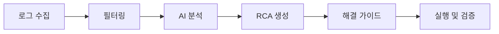

# Frontend Development Guide - Anomaly Predictor View

## 프로젝트 개요 (Project Overview)

### 프로젝트 정보
- **프로젝트명**: Anomaly Predictor View
- **목적**: Ceph 클러스터의 AI 기반 장애 예측 및 운영 최적화를 위한 직관적인 웹 대시보드
- **Ceph 버전**: Squid (19.x)
- **기술 스택**: Vue 3.4.27, Tailwind CSS v3.4.17, Pinia, ECharts, WebSocket STOMP
- **빌드 도구**: Vite 5.0
- **스타일링**: Tailwind CSS with 'ceph-' prefix
- **AI/ML 기능**: RAG 기반 조치 가이드, 실시간 이상감지, ML 예측 모델

### 연관 프로젝트들
#### 1. predictor-api
- 현재 프로젝트(predictor-view) 의 백엔드를 담당하는 프로젝트
- ollama 에서 제공하는 API 를 통해 llm 을 이용하고, 이를 통해 ceph 에서 수집한 data 를 기반으로 인공지능 기능(장애예측 등)을 수행하는 역할도 한다.
- 인공지능 기능을 사용시 정확도 향상을 위해 RAG 기능을 이용하는데, 이때 ceph-doc-crawler 프로젝트의 Qdrant 의 정보를 조회한다.
- 위치 : /Users/jclee/Documents/Okestro/Projects/DevSw/anomaly-predictor-api
#### 2. predictor
- go-ceph 를 이용하여 ceph 의 metric 등의 data 들을 주기적으로 prometheus 로 수집하고, 직접적으로 REST Api 로도 제공하는 프로젝트
- ceph 내부에 custom service 로 등록된다.
- 위치 : /Users/jclee/Documents/Okestro/Projects/DevSw/anomaly-predictor
#### 3. ceph-doc-crawler
- ceph 공식문서를 크롤링하고 이를 벡터화 하여 Qdrant 에 저장하는 프로젝트
- predictor-api 에서 RAG 기능으로 Qdrant 의 정보를 참고한다.
- 위치 : /Users/jclee/Documents/Okestro/Projects/DevSw/ceph-doc-crawler

### 핵심 기능
1. 실시간 클러스터 모니터링 대시보드
2. AI 기반 장애 예측 및 위험 분석
3. PG 최적화 및 설정 관리
4. 로그 분석 기반 트러블슈팅 가이드
5. 자동화된 운영 리포트 생성
6. RAG 기반 지능형 조치 가이드
7. ML 실시간 이상감지 시스템

### Ceph Squid 버전 특화 기능
- **NVMe/RoCE 최적화 모니터링**: NVMe-oF 및 RoCE 성능 메트릭 시각화
- **BlueStore 개선사항**: 압축률, 캐시 히트율 실시간 모니터링
- **QoS 정책 관리**: Pool별 IOPS/BW 제한 설정 UI
- **Stretch Cluster 지원**: 다중 사이트 클러스터 상태 통합 뷰
- **Crimson OSD 모니터링**: 차세대 OSD 성능 메트릭 대시보드

### UI/UX 디자인 원칙
- **반응형 디자인**: 모바일, 태블릿, 데스크톱 완벽 지원
- **다크/라이트 테마**: 사용자 선호도에 따른 테마 전환
- **직관적 내비게이션**: Mega Menu 방식의 구조화된 메뉴
- **실시간 업데이트**: WebSocket을 통한 실시간 데이터 반영
- **접근성**: WCAG 2.1 가이드라인 준수

## 기능 요구사항 (Feature Requirements)

### 1. 현황 대시보드 (Dashboard)

#### 1.1 레이아웃 구성
```
┌─────────────────────────────────────────────────────┐
│                    Header (Logo, Theme, User)       │
├─────────────────────────────────────────────────────┤
│                    Mega Menu Navigation             │
├─────────────────────────────────────────────────────┤
│  ┌─────────┐  ┌─────────┐  ┌─────────┐            │
│  │ Cluster │  │Capacity │  │  Risk   │            │
│  │ Status  │  │ Status  │  │  Panel  │            │
│  └─────────┘  └─────────┘  └─────────┘            │
│  ┌──────────────────────────────────┐              │
│  │       Real-time Charts Grid      │              │
│  │  (8 different metric charts)     │              │
│  └──────────────────────────────────┘              │
│  ┌──────────────────────────────────┐              │
│  │        Alert Center               │              │
│  └──────────────────────────────────┘              │
└─────────────────────────────────────────────────────┘
```

#### 1.2 컴포넌트 구조
- **ClusterStatus.vue**: 클러스터 상태 표시 카드
  - Health 상태 (OK/WARN/ERR)
  - OSD 상태 (Up/Down/In/Out)
  - MON/MGR/MDS 상태
  
- **CapacityStatus.vue**: 용량 현황 카드
  - 전체 용량 게이지
  - Pool별 사용률 도넛 차트
  - 7일 트렌드 스파크라인

- **Charts 컴포넌트**: 8개 실시간 차트
  - PoolUsageChart.vue
  - IopsChart.vue
  - LatencyChart.vue
  - ScrubErrorChart.vue
  - PgInconsistencyChart.vue
  - NetworkErrorChart.vue
  - OsdPerformanceChart.vue
  - ThroughputChart.vue

### 2. 장애 예측 (Prediction)

#### 2.1 예측 카테고리 (12개)
```javascript
const predictionCategories = [
  { id: 'osd-failure', name: 'OSD 장애', icon: 'disk', riskLevel: 'high' },
  { id: 'capacity-exhaustion', name: '용량 고갈', icon: 'storage', riskLevel: 'medium' },
  { id: 'performance-degradation', name: '성능 저하', icon: 'speed', riskLevel: 'low' },
  { id: 'pg-imbalance', name: 'PG 불균형', icon: 'balance', riskLevel: 'medium' },
  { id: 'network-bottleneck', name: '네트워크 병목', icon: 'network', riskLevel: 'high' },
  { id: 'memory-shortage', name: '메모리 부족', icon: 'memory', riskLevel: 'critical' },
  { id: 'rebalancing-needed', name: '리밸런싱 필요', icon: 'refresh', riskLevel: 'medium' },
  { id: 'hotspot-osd', name: '핫스팟 OSD', icon: 'fire', riskLevel: 'high' },
  { id: 'cluster-expansion', name: '클러스터 확장', icon: 'expand', riskLevel: 'low' },
  { id: 'smart-disk-failure', name: 'SMART 디스크', icon: 'alert', riskLevel: 'critical' },
  { id: 'metric-disk-failure', name: '메트릭 디스크', icon: 'chart', riskLevel: 'high' },
  { id: 'comprehensive', name: '종합 분석', icon: 'dashboard', riskLevel: 'medium' }
]
```

#### 2.2 위험도 시각화
- **Critical**: 빨간색 (#EF4444)
- **High**: 주황색 (#F97316) 
- **Medium**: 노란색 (#F59E0B)
- **Low**: 파란색 (#06B6D4)

### 3. 설정 최적화 (Optimization)

#### 3.1 PG 계산기 UI
```vue
<template>
  <div class="ceph-card ceph-p-6">
    <h3 class="ceph-text-xl ceph-font-semibold ceph-mb-4">PG 계산기</h3>
    
    <div class="ceph-grid ceph-grid-cols-2 ceph-gap-4">
      <div class="ceph-form-group">
        <label class="ceph-label">OSD 수</label>
        <input type="number" v-model="osdCount" class="ceph-input" />
      </div>
      
      <div class="ceph-form-group">
        <label class="ceph-label">복제 수</label>
        <input type="number" v-model="replicaSize" class="ceph-input" />
      </div>
      
      <div class="ceph-form-group">
        <label class="ceph-label">Pool 타입</label>
        <select v-model="poolType" class="ceph-select">
          <option value="replicated">Replicated</option>
          <option value="erasure">Erasure</option>
        </select>
      </div>
      
      <div class="ceph-form-group">
        <label class="ceph-label">Target PGs per OSD</label>
        <input type="range" v-model="targetPgsPerOsd" 
               min="50" max="200" class="ceph-slider" />
        <span class="ceph-text-sm">{{ targetPgsPerOsd }}</span>
      </div>
    </div>
    
    <div class="ceph-mt-6 ceph-p-4 ceph-bg-gray-50 dark:ceph-bg-gray-800 ceph-rounded-lg">
      <h4 class="ceph-font-medium ceph-mb-2">계산 결과</h4>
      <div class="ceph-grid ceph-grid-cols-3 ceph-gap-4">
        <div>
          <span class="ceph-text-sm ceph-text-gray-600">권장 PG 수</span>
          <p class="ceph-text-2xl ceph-font-bold">{{ recommendedPgs }}</p>
        </div>
        <div>
          <span class="ceph-text-sm ceph-text-gray-600">최대 PG 수</span>
          <p class="ceph-text-2xl ceph-font-bold">{{ maxPgs }}</p>
        </div>
        <div>
          <span class="ceph-text-sm ceph-text-gray-600">PG per OSD</span>
          <p class="ceph-text-2xl ceph-font-bold">{{ pgsPerOsd }}</p>
        </div>
      </div>
    </div>
  </div>
</template>
```

### 4. 트러블슈팅 (Troubleshooting)

#### 4.1 로그 분석 워크플로우


#### 4.2 알람 우선순위 관리
- **칸반 보드 레이아웃**
  - 긴급 (Critical): 즉시 조치 필요
  - 중요 (High): 24시간 내 조치
  - 일반 (Medium): 주간 단위 검토
  - 정보 (Low): 모니터링 대상

### 5. RAG 기반 조치 가이드 (RAG-based Action Guide)

#### 5.1 ceph-doc-crawler 통합
RAG 시스템은 ceph-doc-crawler API를 통해 문서 검색을 수행하며, sentence-transformers 기반 임베딩 모델을 사용합니다.

**주요 특징:**
- sentence-transformers/all-MiniLM-L6-v2 모델 기반 임베딩
- Ceph Squid 공식 문서 크롤링 및 실시간 검색
- hotk.co.kr:8000 배포된 크롤러 API와 연동
- 한국어/영어 다국어 지원
- 문서 타입별 필터링 (cli, config, troubleshooting, architecture)

#### 5.2 지능형 검색 인터페이스
```vue
<template>
  <div class="ceph-flex ceph-flex-col ceph-gap-4">
    <!-- 검색 입력 영역 -->
    <div class="ceph-relative">
      <input 
        v-model="searchQuery"
        @keyup.enter="askRAG"
        placeholder="클러스터 문제를 설명하세요..."
        class="ceph-w-full ceph-px-4 ceph-py-3 ceph-rounded-lg 
               ceph-border ceph-border-gray-300 
               focus:ceph-ring-2 focus:ceph-ring-primary-500"
      />
      <button 
        @click="askRAG"
        class="ceph-absolute ceph-right-2 ceph-top-2 
               ceph-p-2 ceph-rounded-md 
               ceph-bg-primary-500 ceph-text-white">
        <SearchIcon />
      </button>
    </div>
    
    <!-- AI 응답 영역 -->
    <div v-if="ragResponse" 
         class="ceph-bg-blue-50 dark:ceph-bg-blue-900/20 
                ceph-rounded-lg ceph-p-6">
      <h4 class="ceph-font-semibold ceph-mb-3">
        <AIIcon class="ceph-inline ceph-mr-2" />
        AI 조치 가이드 (sentence-transformers 기반)
      </h4>
      <div class="ceph-prose" v-html="ragResponse.summary"></div>
      
      <!-- 추천 명령어 -->
      <div class="ceph-mt-4 ceph-space-y-2" v-if="ragResponse.commands?.length">
        <h5 class="ceph-text-sm ceph-font-medium ceph-mb-2">안전 검증된 명령어:</h5>
        <div v-for="command in ragResponse.commands" :key="command.cmd"
             class="ceph-bg-gray-50 dark:ceph-bg-gray-700 ceph-p-3 ceph-rounded-md">
          <code class="ceph-text-sm ceph-font-mono">{{ command.cmd }}</code>
          <p class="ceph-text-xs ceph-text-gray-600 ceph-mt-1">{{ command.why }}</p>
          <span class="ceph-text-xs ceph-px-2 ceph-py-1 ceph-rounded ceph-bg-green-100 ceph-text-green-800">
            {{ command.category }}
          </span>
        </div>
      </div>
      
      <!-- ceph-doc-crawler 참조 문서 -->
      <div class="ceph-mt-4 ceph-pt-4 ceph-border-t">
        <h5 class="ceph-text-sm ceph-font-medium ceph-mb-2">참조 문서 (ceph-doc-crawler):</h5>
        <ul class="ceph-space-y-1">
          <li v-for="source in ragResponse.sources" :key="source">
            <a :href="source" class="ceph-text-primary-600 hover:ceph-underline ceph-text-sm">
              {{ source }}
            </a>
          </li>
        </ul>
      </div>
    </div>
    
    <!-- 실시간 제안 -->
    <div v-if="suggestions.length" 
         class="ceph-grid ceph-grid-cols-1 md:ceph-grid-cols-2 ceph-gap-3">
      <button 
        v-for="suggestion in suggestions" 
        :key="suggestion.id"
        @click="applySuggestion(suggestion)"
        class="ceph-p-3 ceph-bg-white dark:ceph-bg-gray-800 
               ceph-rounded-lg ceph-border ceph-text-left 
               hover:ceph-shadow-md ceph-transition-shadow">
        <span class="ceph-font-medium">{{ suggestion.title }}</span>
        <p class="ceph-text-sm ceph-text-gray-600 ceph-mt-1">
          {{ suggestion.description }}
        </p>
      </button>
    </div>
  </div>
</template>
```

#### 5.3 컨텍스트 기반 조치 제안
- sentence-transformers를 통한 의미 기반 문서 검색
- ceph-doc-crawler에서 수집한 Ceph 공식 문서 기반 답변
- 현재 클러스터 상태와 연계한 맞춤형 가이드
- 안전성 검증된 명령어만 제공 (위험 명령어 자동 필터링)
- 단계별 해결 가이드 생성 및 실행 검증

### 6. ML 실시간 이상감지 (ML Real-time Anomaly Detection)

#### 6.1 이상감지 대시보드
```vue
<template>
  <div class="ceph-grid ceph-grid-cols-12 ceph-gap-4">
    <!-- 이상 점수 게이지 -->
    <div class="ceph-col-span-3">
      <AnomalyScoreGauge 
        :score="anomalyScore"
        :threshold="threshold"
        :trend="scoreTrend"
      />
    </div>
    
    <!-- 실시간 이상 패턴 히트맵 -->
    <div class="ceph-col-span-6">
      <AnomalyHeatmap 
        :data="anomalyPatterns"
        :timeRange="selectedTimeRange"
        @cell-click="showAnomalyDetails"
      />
    </div>
    
    <!-- 이상 감지 알림 -->
    <div class="ceph-col-span-3">
      <div class="ceph-space-y-2">
        <AnomalyAlert 
          v-for="alert in recentAnomalies"
          :key="alert.id"
          :alert="alert"
          :ml-model="alert.detectedBy"
          :confidence="alert.confidence"
        />
      </div>
    </div>
    
    <!-- ML 모델 성능 지표 -->
    <div class="ceph-col-span-12 ceph-mt-4">
      <ModelPerformanceMetrics 
        :precision="modelMetrics.precision"
        :recall="modelMetrics.recall"
        :f1Score="modelMetrics.f1Score"
        :lastTraining="modelMetrics.lastTrainingTime"
      />
    </div>
  </div>
</template>
```

#### 6.2 이상감지 컴포넌트 구조
- **AnomalyScoreGauge.vue**: 실시간 이상 점수 표시
- **AnomalyHeatmap.vue**: 시계열 이상 패턴 히트맵
- **AnomalyAlert.vue**: 이상 감지 알림 카드
- **ModelPerformanceMetrics.vue**: ML 모델 성능 대시보드
- **AnomalyTimeline.vue**: 이상 이벤트 타임라인

### 7. 3D 클러스터 토폴로지 시각화 (3D Cluster Topology Visualization)

#### 7.1 우주선 대시보드 컨셉
ClusterTopologyVisualization.vue는 Three.js를 사용하여 Ceph 클러스터를 우주 공간 환경에서 시각화합니다.

**주요 특징:**
- 별이 반짝이는 우주 배경
- 4계층 노드 구조 (Pool → PG → OSD → Host)
- 사이버펑크 스타일의 패널 UI
- 실시간 검색 및 인터랙션 시스템

#### 7.2 노드 계층 구조
```javascript
// 노드 레벨 구성 (Y 축 기준)
const nodeLevels = {
  pools: { y: 30, geometry: 'SphereGeometry', texture: 'Earth' },
  pgs: { y: -20, geometry: 'DodecahedronGeometry', material: 'Metallic' },
  osds: { y: -60, geometry: 'CylinderGeometry', groupBy: 'host' },
  hosts: { y: -60, geometry: 'CircleGeometry', type: 'platform' }
}
```

#### 7.3 시각화 컴포넌트 구조
```vue
<template>
  <div class="topology-container">
    <!-- Three.js Canvas -->
    <canvas ref="canvasRef" class="topology-canvas"></canvas>
    
    <!-- 좌상단 검색 패널 -->
    <div class="search-panel">
      <select v-model="searchType">
        <option value="pool">Pool</option>
        <option value="pg" :disabled="!isPgSearchEnabled">PG</option>
        <option value="osd">OSD</option>
        <option value="host">Host</option>
      </select>
      <input v-model="searchQuery" @input="performSearch" />
    </div>
    
    <!-- 4개 우주선 대시보드 패널 -->
    <div class="spaceship-panel panel-top"><!-- Cluster Command Center --></div>
    <div class="spaceship-panel panel-left"><!-- AI Threat Analysis --></div>
    <div class="spaceship-panel panel-bottom"><!-- Quick Status --></div>
    <div class="spaceship-panel panel-right"><!-- Performance Matrix --></div>
  </div>
</template>
```

#### 7.4 Three.js 시스템 구성
```javascript
// 초기화 함수들
function initThree() {
  // Scene, Camera, Renderer 설정
  scene = new THREE.Scene()
  camera = new THREE.PerspectiveCamera(75, window.innerWidth / window.innerHeight, 0.1, 2000)
  renderer = new THREE.WebGLRenderer({ antialias: true, alpha: true })
  
  // 조명 시스템
  const ambientLight = new THREE.AmbientLight(0x404040, 0.5)
  const directionalLight = new THREE.DirectionalLight(0xffffff, 1.5)
  const pgLevelLight = new THREE.PointLight(0xffffff, 0.8, 150)
  
  // 별 배경과 클러스터 토폴로지 생성
  starField = createStarField()
  createClusterTopology()
}

// 노드 생성 함수들
function createPoolNode(poolData) {
  // 지구 텍스처와 대기권 효과를 적용한 구형 노드
  const geometry = new THREE.SphereGeometry(5, 32, 32)
  const material = new THREE.MeshStandardMaterial({
    map: albedoMap, bumpMap: bumpMap, emissiveMap: lightsMap
  })
}

function createPGNode(pgData) {
  // 십이면체 형태의 메탈릭 노드
  const geometry = new THREE.DodecahedronGeometry(2)
  const material = new THREE.MeshStandardMaterial({ metalness: 1.0, roughness: 0.05 })
}
```

#### 7.5 인터랙션 시스템
- **검색 기능**: 타입별 노드 검색 및 펄스 애니메이션
- **클릭 선택**: Raycaster를 통한 노드 선택 및 정보 패널 표시
- **키보드 단축키**: Ctrl+클릭으로 모든 패널 토글
- **풀스크린 모드**: 헤더 숨김/표시 및 캔버스 크기 조정

#### 7.6 상태 시각화 시스템
```javascript
// 상태별 색상 및 효과
const nodeStates = {
  healthy: { color: 0x4ade80, effects: ['atmosphere'] },
  warning: { color: 0xf59e0b, effects: ['warning-ring'] },
  error: { color: 0xff3333, effects: ['error-ring', 'pulse'] }
}

// 건강하지 않은 Pool 노드에 회전하는 링 추가
function addHealthRing(poolNode, health) {
  const ringMaterial = new THREE.ShaderMaterial({
    uniforms: { time: { value: 0 }, color: { value: stateColor } },
    // 회전하는 그라디언트 셰이더
  })
}
```

### 8. 운영문서 (Reports)

#### 8.1 리포트 템플릿 구조
```javascript
const reportTemplate = {
  daily: {
    sections: [
      'executiveSummary',
      'healthStatus',
      'performanceMetrics',
      'criticalAlerts',
      'recommendations'
    ]
  },
  weekly: {
    sections: [
      'executiveSummary',
      'trendAnalysis',
      'capacityForecast',
      'incidentSummary',
      'optimizationSuggestions'
    ]
  },
  monthly: {
    sections: [
      'executiveSummary',
      'comprehensiveAnalysis',
      'growthProjection',
      'costAnalysis',
      'strategicRecommendations'
    ]
  }
}
```

## 관련 코드 (Relevant Codes)

### Tailwind CSS 설정 (with ceph- prefix)
```javascript
// tailwind.config.js
module.exports = {
  prefix: 'ceph-',
  content: ['./index.html', './src/**/*.{vue,js,ts,jsx,tsx}'],
  darkMode: 'class',
  theme: {
    extend: {
      colors: {
        primary: {
          50: '#eff6ff',
          100: '#dbeafe',
          200: '#bfdbfe',
          300: '#93c5fd',
          400: '#60a5fa',
          500: '#3b82f6',
          600: '#2563eb',
          700: '#1d4ed8',
          800: '#1e40af',
          900: '#1e3a8a'
        },
        success: {
          DEFAULT: '#10b981',
          dark: '#059669'
        },
        warning: {
          DEFAULT: '#f59e0b',
          dark: '#d97706'
        },
        danger: {
          DEFAULT: '#ef4444',
          dark: '#dc2626'
        },
        info: {
          DEFAULT: '#06b6d4',
          dark: '#0891b2'
        }
      },
      animation: {
        'pulse-slow': 'pulse 3s cubic-bezier(0.4, 0, 0.6, 1) infinite',
        'slide-in': 'slideIn 0.3s ease-out',
        'fade-in': 'fadeIn 0.5s ease-in'
      },
      keyframes: {
        slideIn: {
          '0%': { transform: 'translateX(-100%)' },
          '100%': { transform: 'translateX(0)' }
        },
        fadeIn: {
          '0%': { opacity: '0' },
          '100%': { opacity: '1' }
        }
      }
    }
  },
  plugins: [
    require('@tailwindcss/forms'),
    require('@tailwindcss/typography')
  ]
}
```

### 공통 컴포넌트 스타일 가이드
```vue
<!-- Card Component -->
<template>
  <div class="ceph-bg-white dark:ceph-bg-gray-800 
              ceph-rounded-lg ceph-shadow-md 
              ceph-p-6 ceph-transition-all 
              hover:ceph-shadow-lg">
    <slot />
  </div>
</template>

<!-- Button Component -->
<template>
  <button :class="buttonClasses" @click="handleClick">
    <slot />
  </button>
</template>

<script setup>
import { computed } from 'vue'

const props = defineProps({
  variant: {
    type: String,
    default: 'primary',
    validator: (value) => ['primary', 'secondary', 'danger', 'success'].includes(value)
  },
  size: {
    type: String,
    default: 'md',
    validator: (value) => ['sm', 'md', 'lg'].includes(value)
  }
})

const buttonClasses = computed(() => {
  const base = 'ceph-inline-flex ceph-items-center ceph-justify-center ceph-font-medium ceph-rounded-md ceph-transition-colors focus:ceph-outline-none focus:ceph-ring-2 focus:ceph-ring-offset-2'
  
  const variants = {
    primary: 'ceph-bg-primary-600 ceph-text-white hover:ceph-bg-primary-700 focus:ceph-ring-primary-500',
    secondary: 'ceph-bg-gray-200 ceph-text-gray-900 hover:ceph-bg-gray-300 focus:ceph-ring-gray-500',
    danger: 'ceph-bg-danger ceph-text-white hover:ceph-bg-danger-dark focus:ceph-ring-danger',
    success: 'ceph-bg-success ceph-text-white hover:ceph-bg-success-dark focus:ceph-ring-success'
  }
  
  const sizes = {
    sm: 'ceph-px-3 ceph-py-1.5 ceph-text-sm',
    md: 'ceph-px-4 ceph-py-2 ceph-text-base',
    lg: 'ceph-px-6 ceph-py-3 ceph-text-lg'
  }
  
  return [base, variants[props.variant], sizes[props.size]]
})
</script>
```

### ECharts 테마 설정
```javascript
// utils/chartTheme.js
export const cephChartTheme = {
  color: [
    '#3b82f6', // primary
    '#10b981', // success
    '#f59e0b', // warning
    '#ef4444', // danger
    '#06b6d4', // info
    '#8b5cf6', // purple
    '#ec4899', // pink
    '#14b8a6'  // teal
  ],
  backgroundColor: 'transparent',
  textStyle: {
    fontFamily: 'Inter, system-ui, sans-serif'
  },
  title: {
    textStyle: {
      color: '#1f2937',
      fontSize: 16,
      fontWeight: 600
    }
  },
  axisLine: {
    lineStyle: {
      color: '#e5e7eb'
    }
  },
  splitLine: {
    lineStyle: {
      color: '#f3f4f6'
    }
  },
  tooltip: {
    backgroundColor: 'rgba(255, 255, 255, 0.95)',
    borderColor: '#e5e7eb',
    borderWidth: 1,
    textStyle: {
      color: '#1f2937'
    }
  }
}

// Dark theme variant
export const cephChartThemeDark = {
  ...cephChartTheme,
  title: {
    textStyle: {
      color: '#f3f4f6',
      fontSize: 16,
      fontWeight: 600
    }
  },
  axisLine: {
    lineStyle: {
      color: '#4b5563'
    }
  },
  splitLine: {
    lineStyle: {
      color: '#374151'
    }
  },
  tooltip: {
    backgroundColor: 'rgba(31, 41, 55, 0.95)',
    borderColor: '#4b5563',
    textStyle: {
      color: '#f3f4f6'
    }
  }
}
```

### WebSocket 실시간 업데이트 패턴
```javascript
// composables/useRealtimeData.js
import { ref, onMounted, onUnmounted } from 'vue'
import { useWebSocket } from './useWebSocket'

export function useRealtimeData(topic) {
  const data = ref(null)
  const loading = ref(true)
  const error = ref(null)
  const { client } = useWebSocket()
  let subscription = null

  const subscribe = () => {
    if (client.connected) {
      subscription = client.subscribe(topic, (message) => {
        try {
          data.value = JSON.parse(message.body)
          loading.value = false
        } catch (e) {
          error.value = e.message
        }
      })
    }
  }

  const unsubscribe = () => {
    if (subscription) {
      subscription.unsubscribe()
    }
  }

  onMounted(() => {
    subscribe()
  })

  onUnmounted(() => {
    unsubscribe()
  })

  return {
    data,
    loading,
    error
  }
}
```

## 현재 파일 구조 (Current File Structure)

```
src/
├── components/
│   ├── layout/
│   │   ├── AppHeader.vue
│   │   ├── MegaMenu.vue
│   │   ├── ThemeToggle.vue
│   │   └── UserProfile.vue
│   ├── topology/
│   │   └── ClusterTopologyVisualization.vue
│   ├── particles/
│   │   └── CephClusterVisualization.vue
│   ├── dashboard/
│   │   ├── ClusterStatus.vue
│   │   ├── CapacityStatus.vue
│   │   ├── AlertCenter.vue
│   │   ├── RiskPanel.vue
│   │   └── charts/
│   │       ├── PoolUsageChart.vue
│   │       ├── IopsChart.vue
│   │       ├── LatencyChart.vue
│   │       ├── ScrubErrorChart.vue
│   │       ├── PgInconsistencyChart.vue
│   │       ├── NetworkErrorChart.vue
│   │       ├── OsdPerformanceChart.vue
│   │       └── ThroughputChart.vue
│   ├── prediction/
│   │   ├── PredictionGrid.vue
│   │   ├── PredictionCard.vue
│   │   ├── PredictionModal.vue
│   │   ├── RiskDashboard.vue
│   │   ├── RiskGauge.vue
│   │   └── MitigationPlan.vue
│   ├── anomaly/
│   │   ├── AnomalyScoreGauge.vue
│   │   ├── AnomalyHeatmap.vue
│   │   ├── AnomalyAlert.vue
│   │   ├── ModelPerformanceMetrics.vue
│   │   └── AnomalyTimeline.vue
│   ├── rag/
│   │   ├── RagSearchInterface.vue
│   │   ├── RagResponse.vue
│   │   ├── RagSuggestions.vue
│   │   ├── CommandGenerator.vue
│   │   └── DocumentReferences.vue
│   ├── optimization/
│   │   ├── PgCalculator.vue
│   │   ├── PgDistribution.vue
│   │   ├── HostPgHeatmap.vue
│   │   ├── PgStatusMonitor.vue
│   │   └── RebalanceSimulation.vue
│   ├── troubleshooting/
│   │   ├── LogAnalyzer.vue
│   │   ├── LogFilter.vue
│   │   ├── RcaResult.vue
│   │   ├── EventTimeline.vue
│   │   ├── AlarmKanban.vue
│   │   └── AlarmCorrelation.vue
│   ├── reports/
│   │   ├── ImpactAssessment.vue
│   │   ├── InsightReport.vue
│   │   ├── ReportScheduler.vue
│   │   ├── ReportHistory.vue
│   │   └── ReportTemplate.vue
│   └── common/
│       ├── LoadingSpinner.vue
│       ├── ErrorMessage.vue
│       ├── ConfirmDialog.vue
│       ├── DataTable.vue
│       └── Card.vue
├── views/
│   ├── DashboardView.vue
│   ├── PredictionView.vue
│   ├── OptimizationView.vue
│   ├── TroubleshootingView.vue
│   └── ReportsView.vue
├── composables/
│   ├── useTheme.js
│   ├── useWebSocket.js
│   ├── useChart.js
│   ├── useNotification.js
│   ├── useApi.js
│   └── useResponsive.js
├── services/
│   ├── api.js
│   ├── cluster.service.js
│   ├── prediction.service.js
│   ├── optimization.service.js
│   ├── troubleshooting.service.js
│   ├── reports.service.js
│   ├── websocket.service.js
│   ├── rag.service.js
│   ├── ml.service.js
│   └── ceph-squid.service.js
├── stores/
│   ├── cluster.js
│   ├── prediction.js
│   ├── optimization.js
│   ├── troubleshooting.js
│   ├── reports.js
│   ├── websocket.js
│   ├── anomaly.js
│   ├── rag.js
│   └── ceph-squid.js
├── utils/
│   ├── constants.js
│   ├── formatters.js
│   ├── validators.js
│   ├── chartOptions.js
│   └── dateUtils.js
├── assets/
│   ├── styles/
│   │   ├── main.css
│   │   ├── tailwind.css
│   │   └── variables.css
│   └── images/
│       ├── logo.svg
│       └── icons/
└── locales/
    ├── ko.json
    └── en.json
```

## 개발 규칙 (Development Rules)

### 1. 코딩 컨벤션

#### 1.1 Vue 컴포넌트
- **Composition API** 사용 (Options API 금지)
- **`<script setup>`** 문법 사용
- **TypeScript** 지원을 위한 타입 정의 추가
- 컴포넌트명은 **PascalCase** 사용
- Props는 **camelCase** 사용

```vue
<!-- Good -->
<script setup>
import { ref, computed } from 'vue'

const props = defineProps({
  userName: String,
  userId: Number
})

const emit = defineEmits(['update', 'delete'])
</script>

<!-- Bad -->
<script>
export default {
  props: ['user-name', 'user-id'],
  data() {
    return {}
  }
}
</script>
```

#### 1.2 Tailwind CSS 클래스 규칙
- 모든 Tailwind 클래스에 **`ceph-`** prefix 필수
- 클래스 순서: 레이아웃 → 박스모델 → 타이포그래피 → 시각효과 → 기타
- 반응형 클래스는 모바일 우선 (mobile-first)

```vue
<!-- Good -->
<div class="ceph-flex ceph-items-center ceph-justify-between 
            ceph-p-4 ceph-bg-white dark:ceph-bg-gray-800 
            ceph-rounded-lg ceph-shadow-md 
            hover:ceph-shadow-lg ceph-transition-shadow">
  <!-- content -->
</div>

<!-- Bad -->
<div class="flex p-4 shadow-md items-center bg-white rounded-lg">
  <!-- content -->
</div>
```

#### 1.3 파일 명명 규칙
- 컴포넌트: **PascalCase.vue** (예: `UserProfile.vue`)
- Composables: **use로 시작** (예: `useAuth.js`)
- Services: **도메인.service.js** (예: `cluster.service.js`)
- Utils: **camelCase.js** (예: `dateUtils.js`)

### 2. 상태 관리 규칙

#### 2.1 Pinia Store 구조
```javascript
// stores/cluster.js
import { defineStore } from 'pinia'
import { ref, computed } from 'vue'
import { clusterService } from '@/services/cluster.service'

export const useClusterStore = defineStore('cluster', () => {
  // State
  const clusterStatus = ref(null)
  const loading = ref(false)
  const error = ref(null)
  
  // Getters
  const isHealthy = computed(() => 
    clusterStatus.value?.health === 'HEALTH_OK'
  )
  
  // Actions
  async function fetchClusterStatus() {
    loading.value = true
    error.value = null
    try {
      clusterStatus.value = await clusterService.getStatus()
    } catch (e) {
      error.value = e.message
    } finally {
      loading.value = false
    }
  }
  
  return {
    // State
    clusterStatus,
    loading,
    error,
    // Getters
    isHealthy,
    // Actions
    fetchClusterStatus
  }
})
```

### 3. API 통신 규칙

#### 3.1 Service Layer Pattern
```javascript
// services/cluster.service.js
import api from './api'

export const clusterService = {
  async getStatus() {
    return await api.get('/cluster/status')
  },
  
  async getMetrics(params) {
    return await api.get('/cluster/metrics', { params })
  },
  
  async updateConfiguration(data) {
    return await api.post('/cluster/configuration', data)
  }
}
```

#### 3.2 에러 처리
```javascript
// composables/useApi.js
export function useApi() {
  const handleError = (error) => {
    if (error.response) {
      // 서버 응답 에러
      switch (error.response.status) {
        case 401:
          // 인증 에러 처리
          router.push('/login')
          break
        case 403:
          // 권한 에러 처리
          showNotification('권한이 없습니다', 'error')
          break
        case 500:
          // 서버 에러 처리
          showNotification('서버 오류가 발생했습니다', 'error')
          break
        default:
          showNotification(error.response.data.message || '오류가 발생했습니다', 'error')
      }
    } else if (error.request) {
      // 네트워크 에러
      showNotification('네트워크 연결을 확인해주세요', 'error')
    } else {
      // 기타 에러
      showNotification('알 수 없는 오류가 발생했습니다', 'error')
    }
  }
  
  return { handleError }
}
```

### 4. 성능 최적화 규칙

#### 4.1 컴포넌트 Lazy Loading
```javascript
// router/index.js
const routes = [
  {
    path: '/',
    name: 'Dashboard',
    component: () => import('@/views/DashboardView.vue')
  },
  {
    path: '/prediction',
    name: 'Prediction',
    component: () => import('@/views/PredictionView.vue')
  }
]
```

#### 4.2 차트 최적화
```javascript
// composables/useChart.js
import { shallowRef, onUnmounted } from 'vue'
import * as echarts from 'echarts/core'

export function useChart(chartRef) {
  const chartInstance = shallowRef(null)
  
  const initChart = (options) => {
    if (chartRef.value) {
      // 기존 인스턴스가 있으면 재사용
      chartInstance.value = echarts.getInstanceByDom(chartRef.value) 
        || echarts.init(chartRef.value)
      chartInstance.value.setOption(options, true)
    }
  }
  
  const resizeChart = () => {
    chartInstance.value?.resize()
  }
  
  onUnmounted(() => {
    chartInstance.value?.dispose()
  })
  
  return {
    initChart,
    resizeChart
  }
}
```

### 5. 테스트 규칙

#### 5.1 Unit Test
```javascript
// tests/unit/components/ClusterStatus.spec.js
import { mount } from '@vue/test-utils'
import { describe, it, expect } from 'vitest'
import ClusterStatus from '@/components/dashboard/ClusterStatus.vue'

describe('ClusterStatus.vue', () => {
  it('displays health status correctly', () => {
    const wrapper = mount(ClusterStatus, {
      props: {
        health: 'HEALTH_OK'
      }
    })
    
    expect(wrapper.find('.ceph-text-success').exists()).toBe(true)
    expect(wrapper.text()).toContain('정상')
  })
  
  it('shows warning icon for HEALTH_WARN', () => {
    const wrapper = mount(ClusterStatus, {
      props: {
        health: 'HEALTH_WARN'
      }
    })
    
    expect(wrapper.find('.ceph-text-warning').exists()).toBe(true)
  })
})
```

### 6. 접근성 규칙

#### 6.1 ARIA 속성
```vue
<template>
  <button
    :aria-label="isExpanded ? '메뉴 닫기' : '메뉴 열기'"
    :aria-expanded="isExpanded"
    @click="toggleMenu"
    class="ceph-p-2"
  >
    <Icon :name="isExpanded ? 'close' : 'menu'" />
  </button>
  
  <nav role="navigation" :aria-hidden="!isExpanded">
    <!-- navigation items -->
  </nav>
</template>
```

#### 6.2 키보드 내비게이션
```javascript
// composables/useKeyboardNavigation.js
export function useKeyboardNavigation() {
  const handleKeyDown = (event) => {
    switch (event.key) {
      case 'Escape':
        closeModal()
        break
      case 'Tab':
        if (event.shiftKey) {
          focusPreviousElement()
        } else {
          focusNextElement()
        }
        break
      case 'Enter':
      case ' ':
        selectCurrentItem()
        break
    }
  }
  
  return { handleKeyDown }
}
```

### 7. 보안 규칙

#### 7.1 XSS 방지
```vue
<!-- Good: Vue는 기본적으로 텍스트를 이스케이프 -->
<template>
  <div>{{ userInput }}</div>
</template>

<!-- Bad: v-html은 신중하게 사용 -->
<template>
  <div v-html="userInput"></div> <!-- XSS 위험! -->
</template>

<!-- v-html을 사용해야 할 경우 sanitization 필수 -->
<script setup>
import DOMPurify from 'dompurify'

const sanitizedHtml = computed(() => 
  DOMPurify.sanitize(props.htmlContent)
)
</script>

<template>
  <div v-html="sanitizedHtml"></div>
</template>
```

#### 7.2 민감 정보 보호
```javascript
// 환경 변수 사용
const API_URL = import.meta.env.VITE_API_URL
const API_KEY = import.meta.env.VITE_API_KEY // 프론트엔드에 노출되므로 주의!

// 민감한 정보는 서버에서 처리
// Bad
const adminPassword = 'hardcoded-password'

// Good
const login = async (credentials) => {
  // 서버에서 인증 처리
  const response = await api.post('/auth/login', credentials)
  return response.data.token
}
```

### 8. 빌드 및 배포 규칙

#### 8.1 환경별 설정
```javascript
// vite.config.js
import { defineConfig } from 'vite'
import vue from '@vitejs/plugin-vue'

export default defineConfig(({ mode }) => {
  return {
    plugins: [vue()],
    base: mode === 'production' ? '/anomaly-predictor/' : '/',
    build: {
      rollupOptions: {
        output: {
          manualChunks: {
            'vendor': ['vue', 'vue-router', 'pinia'],
            'charts': ['echarts', 'vue-echarts'],
            'utils': ['axios', 'dayjs', '@stomp/stompjs']
          }
        }
      }
    }
  }
})
```

#### 8.2 성능 모니터링
```javascript
// main.js
if (import.meta.env.PROD) {
  // Production 환경에서만 성능 모니터링
  const reportWebVitals = (metric) => {
    // Google Analytics or custom monitoring
    console.log(metric)
  }
  
  import('web-vitals').then(({ getCLS, getFID, getFCP, getLCP, getTTFB }) => {
    getCLS(reportWebVitals)
    getFID(reportWebVitals)
    getFCP(reportWebVitals)
    getLCP(reportWebVitals)
    getTTFB(reportWebVitals)
  })
}
```

## 상세 작업 계획 (Detailed Work Plan)

### Phase 1: 프로젝트 초기 설정 (Week 1-2)
- [x] Vue 3 프로젝트 생성 및 설정
- [x] Tailwind CSS with 'ceph-' prefix 설정
- [x] Pinia store 구조 설계
- [x] 라우터 설정 및 페이지 구조 정의
- [x] WebSocket STOMP 연결 설정
- [x] 개발 환경 변수 설정

### Phase 2: 기본 레이아웃 및 공통 컴포넌트 (Week 3-4)
- [x] AppHeader.vue 구현
- [x] MegaMenu.vue 네비게이션 구현
- [x] ThemeToggle.vue 다크/라이트 모드
- [x] 공통 컴포넌트 라이브러리 구축
  - [x] Card.vue
  - [x] Button.vue
  - [x] LoadingSpinner.vue
  - [x] ErrorMessage.vue
  - [x] DataTable.vue

### Phase 3: 대시보드 핵심 기능 (Week 5-7)
- [x] ClusterStatus.vue 구현
- [x] CapacityStatus.vue 구현
- [x] 8개 실시간 차트 컴포넌트 구현
  - [x] PoolUsageChart.vue
  - [x] IopsChart.vue
  - [x] LatencyChart.vue
  - [x] ScrubErrorChart.vue
  - [x] PgInconsistencyChart.vue
  - [x] NetworkErrorChart.vue
  - [x] OsdPerformanceChart.vue
  - [x] ThroughputChart.vue
- [x] WebSocket 실시간 데이터 연동

### Phase 3.5: 3D 클러스터 토폴로지 시각화 (완료)
- [x] Three.js 기반 3D 렌더링 시스템 구축
- [x] 우주 공간 테마 환경 구성
  - [x] 별 배경 시스템 (createStarField)
  - [x] 다중 조명 시스템 (ambient, directional, point lights)
  - [x] 그림자 렌더링 (PCFSoftShadowMap)
- [x] 4계층 노드 시각화 구현
  - [x] Pool 노드: SphereGeometry + 지구 텍스처 + 대기권 효과
  - [x] PG 노드: DodecahedronGeometry + 메탈릭 재질
  - [x] OSD 노드: CylinderGeometry + 호스트별 그룹화
  - [x] Host 노드: CircleGeometry + 원형 플랫폼 (바닥면만)
- [x] 인터랙션 시스템
  - [x] 검색 패널: Pool/PG/OSD/Host 타입별 검색
  - [x] 펄스 애니메이션: GSAP 기반 노드 펄스 효과
  - [x] 풀스크린 모드: 헤더 토글 + 캔버스 자동 크기 조정
  - [x] 패널 제어: Ctrl+클릭으로 4개 패널 동시 토글
  - [x] 노드 선택: Raycaster + 정보 패널 표시
- [x] 우주선 대시보드 UI
  - [x] 상단 중앙 패널: Cluster Command Center (상태, 용량, 스위치)
  - [x] 좌측 하단 패널: AI Threat Analysis (예측, 성능)
  - [x] 중앙 하단 패널: Quick Status (지연시간, 처리량, 알림)
  - [x] 우측 하단 패널: Performance Matrix (실시간 메트릭)
- [x] 시각 효과 및 애니메이션
  - [x] 상태 기반 링: ShaderMaterial 기반 회전 그라디언트
  - [x] 노드 회전: Pool(clouds), OSD, Monitor 자동 회전
  - [x] 패널 애니메이션: slide-search, slide-top, slide-left 등
  - [x] 3D 텍스트 레이블: troika-three-text 기반
- [ ] 실시간 업데이트 시스템 (다음 작업)
  - [ ] 노드 추가/제거/수정 동적 반영
  - [ ] 상태 변화 실시간 업데이트
  - [ ] WebSocket 기반 토폴로지 데이터 스트리밍
  - [ ] PG-OSD 연결선 시각화

### Phase 4: AI/ML 기능 구현 (Week 8-10)
- [ ] 장애 예측 UI 구현
  - [ ] PredictionGrid.vue
  - [ ] PredictionCard.vue
  - [ ] PredictionModal.vue
  - [ ] RiskDashboard.vue
- [ ] ML 이상감지 대시보드
  - [ ] AnomalyScoreGauge.vue
  - [ ] AnomalyHeatmap.vue
  - [ ] AnomalyAlert.vue
  - [ ] ModelPerformanceMetrics.vue
- [ ] ML API 서비스 연동

### Phase 5: RAG 조치 가이드 (Week 11-12)
- [ ] RAG 검색 인터페이스 구현
- [ ] AI 응답 표시 컴포넌트
- [ ] 컨텍스트 기반 제안 UI
- [ ] 명령어 자동 생성 뷰어
- [x] ceph-doc-crawler API 서비스 연동 완료
- [x] sentence-transformers 임베딩 모델 적용

### Phase 6: Ceph Squid 특화 기능 (Week 13-14)
- [ ] NVMe/RoCE 모니터링 대시보드
- [ ] BlueStore 메트릭 시각화
- [ ] QoS 정책 관리 UI
- [ ] Stretch Cluster 상태 뷰
- [ ] Crimson OSD 모니터링

### Phase 7: 최적화 및 트러블슈팅 (Week 15-16)
- [ ] PG 계산기 구현
- [ ] PG 분포 시각화
- [ ] 로그 분석 인터페이스
- [ ] RCA 결과 표시
- [ ] 알람 칸반 보드

### Phase 8: 리포트 및 문서화 (Week 17-18)
- [ ] 리포트 생성 UI
- [ ] 리포트 스케줄러
- [ ] 템플릿 관리
- [ ] PDF/HTML 내보내기

### Phase 9: 테스트 및 최적화 (Week 19-20)
- [ ] Unit 테스트 작성
- [ ] E2E 테스트 구현
- [ ] 성능 최적화
- [ ] 번들 사이즈 최적화
- [ ] 접근성 검증
- [ ] 보안 취약점 스캔

### Phase 10: 배포 준비 (Week 21)
- [ ] Production 빌드 설정
- [ ] Docker 이미지 생성
- [ ] CI/CD 파이프라인 설정
- [ ] 문서화 완료
- [ ] 운영 가이드 작성

## 마일스톤 (Milestones)

### M1: MVP (Week 7)
- 기본 대시보드 기능 완성
- 실시간 모니터링 구현
- WebSocket 연동 완료

### M2: AI/ML Integration (Week 12)
- 장애 예측 기능 완성
- 이상감지 시스템 구현
- RAG 조치 가이드 통합

### M3: Ceph Squid Features (Week 16)
- Squid 버전 특화 기능 완성
- 최적화 도구 구현
- 트러블슈팅 시스템 완료

### M4: Production Ready (Week 21)
- 전체 테스트 완료
- 성능 최적화 완료
- 배포 준비 완료

## 개발 체크리스트

### 컴포넌트 개발 체크리스트
- [ ] Composition API 사용
- [ ] Props 타입 정의
- [ ] Emit 이벤트 정의
- [ ] ceph- prefix 적용
- [ ] 반응형 디자인 확인
- [ ] 다크모드 지원
- [ ] 접근성 속성 추가
- [ ] 에러 처리 구현
- [ ] 로딩 상태 표시
- [ ] 단위 테스트 작성

### 페이지 개발 체크리스트
- [ ] 라우터 설정
- [ ] Store 연결
- [ ] API 서비스 구현
- [ ] WebSocket 구독 설정
- [ ] 에러 바운더리 설정
- [ ] 로딩 스켈레톤 구현
- [ ] 메타 태그 설정
- [ ] 성능 최적화
- [ ] E2E 테스트 작성

### 배포 전 체크리스트
- [ ] 빌드 에러 확인
- [ ] 번들 사이즈 최적화
- [ ] 환경 변수 설정
- [ ] CORS 설정 확인
- [ ] SSL 인증서 확인
- [ ] 성능 테스트
- [ ] 브라우저 호환성 테스트
- [ ] 모바일 반응형 테스트
- [ ] 접근성 검사
- [ ] 보안 취약점 스캔